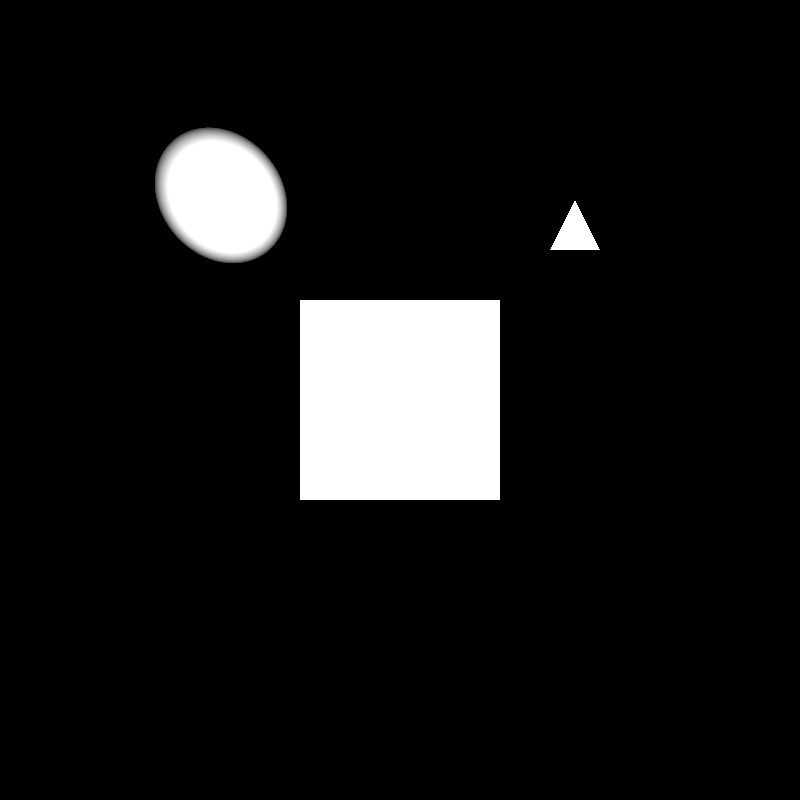
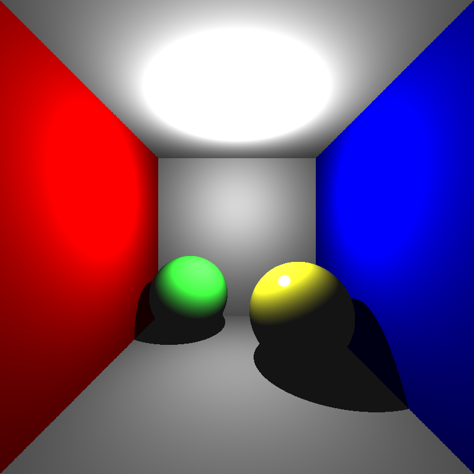
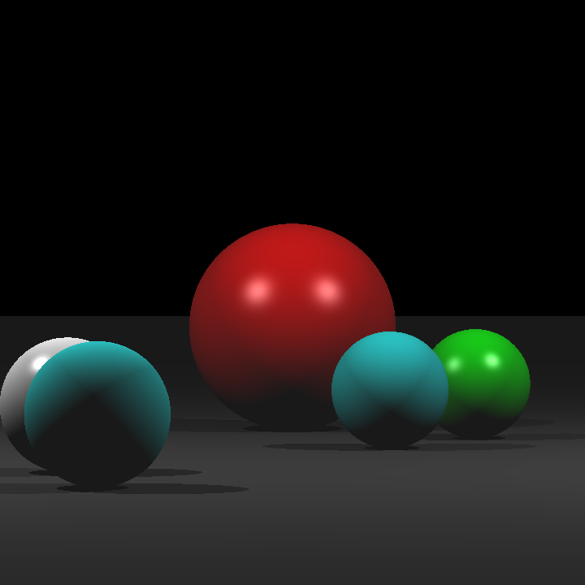
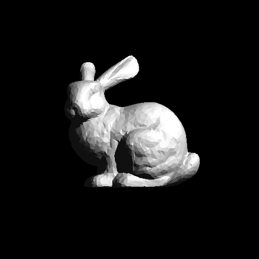
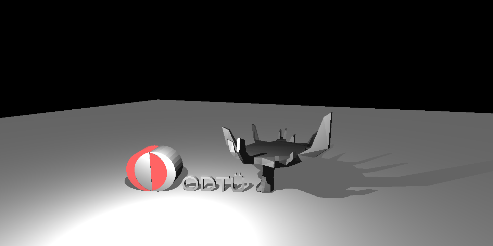

# 1. Basic Ray Tracer

Our very beginning ray tracer will support ray-triangle and ray-sphere intersections with a simple perspective camera model and simple shading models. These include diffuse shading, specular (Blinn-Phong) shading, and ambient shading.

## Input
I will employ custom XML files that define the camera and scene properties as an input of the Ray Tracer. Example XML file:
```markdown
<Scene>
    <BackgroundColor>0 0 0</BackgroundColor>

    <ShadowRayEpsilon>1e-3</ShadowRayEpsilon>

    <IntersectionTestEpsilon>1e-6</IntersectionTestEpsilon>

    <Cameras>
        <Camera id="1">
            <Position>0 0 0</Position>
            <Gaze>0 0 -1</Gaze>
            <Up>0 1 0</Up>
            <NearPlane>-1 1 -1 1</NearPlane>
            <NearDistance>1</NearDistance>
            <ImageResolution>800 800</ImageResolution>
            <ImageName>simple.png</ImageName>
        </Camera>
    </Cameras>

    <Lights>
        <AmbientLight>25 25 25</AmbientLight>
        <PointLight id="1">
            <Position>0 0 0 </Position>
            <Intensity>1000 1000 1000</Intensity>
        </PointLight>
    </Lights>

    <Materials>
        <Material id="1">
            <AmbientReflectance>1 1 1</AmbientReflectance>
            <DiffuseReflectance>1 1 1</DiffuseReflectance>
            <SpecularReflectance>1 1 1</SpecularReflectance>
            <PhongExponent>1</PhongExponent>
        </Material>
    </Materials>

    <VertexData>
        -0.5 0.5 -2
        -0.5 -0.5 -2
        0.5 -0.5 -2
        0.5 0.5 -2
        0.75 0.75 -2
        1 0.75 -2
        0.875 1 -2
        -0.875 1 -2
    </VertexData>

    <Objects>
        <Mesh id="1">
            <Material>1</Material>
            <Faces>
                3 1 2
                1 3 4
            </Faces>
        </Mesh>
        <Triangle id="1">
            <Material>1</Material>
            <Indices>
                5 6 7
            </Indices>
        </Triangle>
        <Sphere id="1">
            <Material>1</Material>
            <Center>8</Center>
            <Radius>0.3</Radius>
        </Sphere>
    </Objects>
</Scene>
```

The XML file is generally self-explanatory. But some points may not be clear: the "Mesh" element defines a collection of triangles using an index-based representation. Indices are 1-based (index 1 represents the first vertex in your vertex list). In order to parse XML file, I use TinyXML lib that parses XML file as a tree and you can reach attributes by preserving nested relationships.

TinyXML can be install with this command:
`sudo apt-get install libtinyxml-dev`

## Code Design
Most probably, I spent the most time on code design. It is very important to define your class and relationship well before coding the tracer. I follow the nested XML features and define classes for almost each attributes.

## Algorithm
```markdown
function main:
1. parse XML file and load object
2. create scene models
3. preprocess (computing "normal" vectors of triangles)
4. for each cameras:
5.     arrange camera perspective
6.     initialize image buffer
7.     for each pixels:
8.         create a ray from camera position to image plane
9.         buffer[pixel] <- rayTracer(ray)
10.    write buffer to PNG file
```

Ray tracer function traces a ray by checking any intersection. If there is a intersection, it computes the closest hit point and the closest distance and normal vector of the intersected object (if intersected object is a sphere) and it finally returns the color of pixel.
```markdown
function rayTracer(ray):
1. find the closest intersected object and distance to it
2. if there is intersection:
3.     compute hit_point
4.     compute normal if object is a sphere
5.     color <- shading(intersected_object, ray, hit_point, normal)
6. else:
6.     color <- zero
7. return color
```

Shading function calculates basic shadings.
```markdown
function shading(intersected_object, ray, hit_point, normal):
1. get the material information of the intersected_object
2. color <- ambient_shading
3. get unit ray vector
4. for each lights:
5.     compute the distance between light position and hit_point
6.     get unit light vector
7.     compute shadow ray origin
8.     check for all object for possible shadow situation
9.     if not isShadow(intersected_object, shadow_ray):
10.        compute intensity at hit_point
11.        color <- color + diffuse_shading
12.        color <- color + specular_shading
13. return color
```

The isShadow function checks if the shadow_ray intersects with any object. The important point here is the shadow_ray is not a unit vector. Its direction is hit_point to the light_position. By the way, we know that the larger intersection distance than one will not cast shadow on this intersected object. Until figure out this situation, I spent much time on this problem :D
Lets look at pseudo code:
```markdown
function isShadow(intersected_object, shadow_ray):
1. for each object:
2.     if the object is not intersected_object:
3.         get the closest distance
4.         if distance < 1 and distance > intersectionTestEpsilon:
5.             return true
6. return false
```

## Writing scene to PNG file
I used thwe basic PNG library to save the scene as a PNG image.

PNG library can be install with this command:
`sudo apt-get install libpng-dev`

## Results
Lets look at the results of my implementation.

### Simple.xml
<p align="left"></p>
This example includes all types of basic objects (triangle and sphere intersections). All reflectance code of materials are the same, white. Thus, resulting image is very simple and show us if intersection checking is true or not. We may not validate the shading computation just by this example. In addition, any object does not cause to cast a shadow by being in front of the light. Thus, we may not check the shadow test. I did not encounter any difficulty while getting this result.

Real running time is 0m0,080s

### Cornellbox.xml
<p align="left"></p>
This example includes meshes and spheres with various materials. It is useful for shadow and shading testing. This example helps me to find a bug on shadow test. Before this example, I didn't check whether the shadow intersection distance is larger than one. So, the shadow rays intersect upper objects even if they do not place between the current object and light source.

Real running time is 0m0,232s

### Spheres.xml
<p align="left"></p>
This example mostly focuses on spheres and phong shading. There are various and bright materials which show the phong shading very clearly. The example also good to see the shadows casted bottom of the spheres. But light placed to top of the space. By the way, previous bug may not detected in the example (the light does not place between any two objects).

Real running time is 0m0,122s

### Bunny.xml
<p align="left"></p>
Real running time is 0m19,812s

### ScienceTree.xml
<p align="left"></p>
Real running time is 0m37,879s

The last two examples are more challenging examples that include many triangles and takes much more time.

I aim to decrease these running times in later improvements :D
