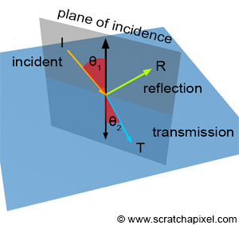
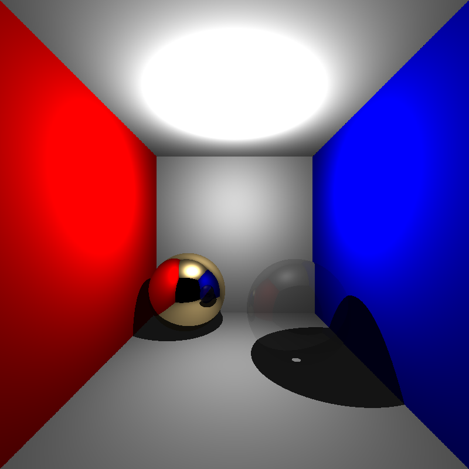
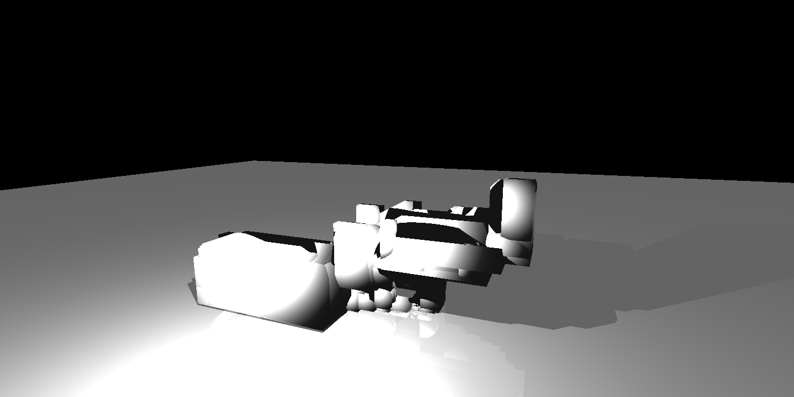
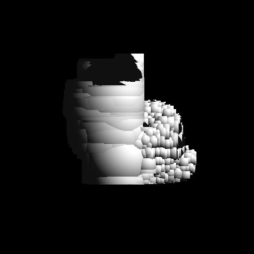
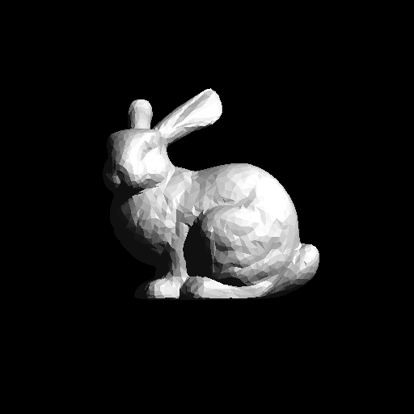
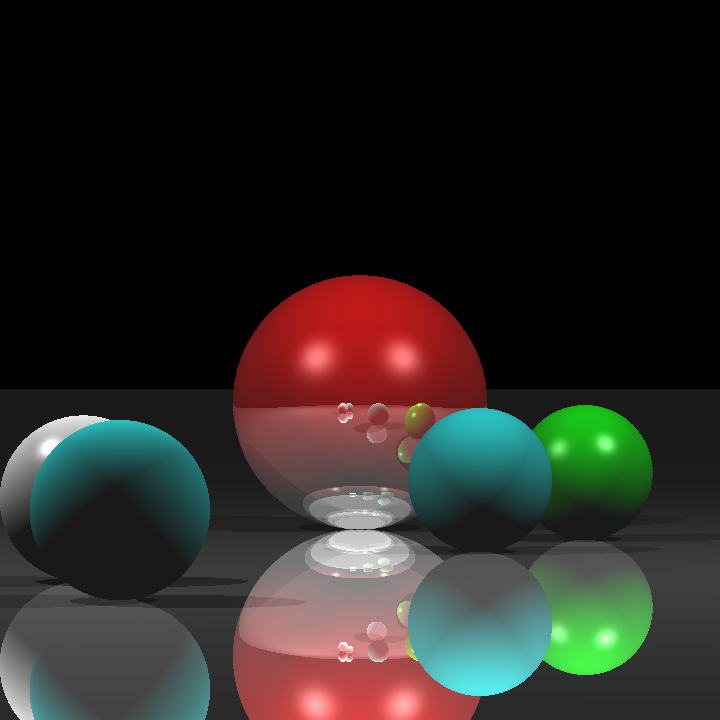
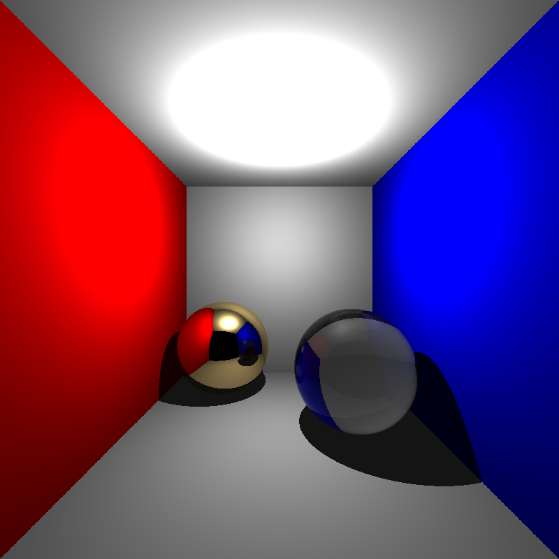
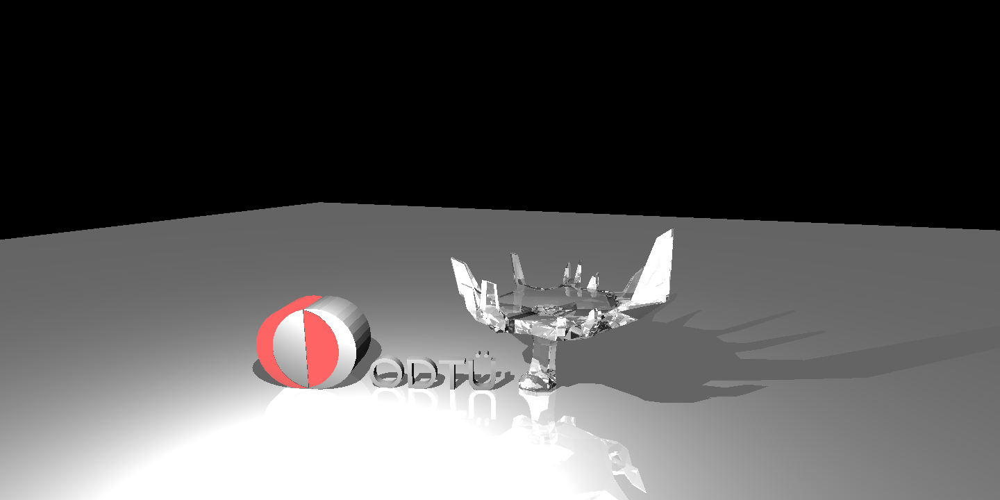
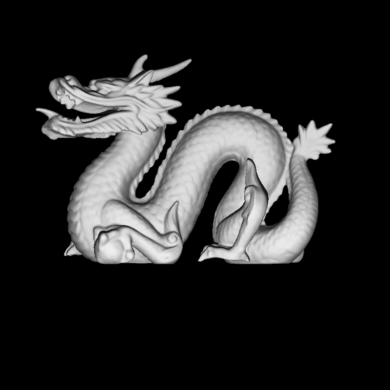
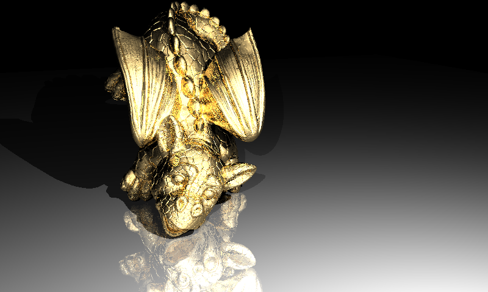

# 1. Reflection and Refraction (recursive ray tracing)

In this section, I shared my experiences during implementing reflection and refraction shadings. This section includes Fresnel coefficient, Snell's and Beer's laws, as well.  

## Input
In order to see the reflection and refraction effects, we need new material types such as mirror, conductor and dielectrics and attributes such as mirror reflectance, reflection and refraction indices.
Reflection and refraction are recursive ray tracing features. To stop and yield a result, we need a recursion depth limit (MaxRecursionDepth).
For these purposes, the input XML files include new attributes. Some of new coming attributes are given below XML file:

```markdown  
<Scene>
    <MaxRecursionDepth>6</MaxRecursionDepth>
    <Material id="1" type="conductor">
        <AmbientReflectance>0 0 0</AmbientReflectance>
        <DiffuseReflectance>0 0 0</DiffuseReflectance>
        <SpecularReflectance>0 0 0</SpecularReflectance>
        <MirrorReflectance>1 0.86 0.57</MirrorReflectance>
        <RefractionIndex>0.370</RefractionIndex>
        <AbsorptionIndex>2.820</AbsorptionIndex>
    </Material>
    <Material id="2" type="dielectric">
        <AmbientReflectance>0 0 0</AmbientReflectance>
        <DiffuseReflectance>0 0 0</DiffuseReflectance>
        <SpecularReflectance>0 0 0</SpecularReflectance>
        <AbsorptionCoefficient>0.01 0.01 0.01</AbsorptionCoefficient>
        <RefractionIndex>1.55</RefractionIndex>
    </Material>
    <Material id="3" type="mirror">
        <AmbientReflectance> 1 1 1 </AmbientReflectance>
        <DiffuseReflectance> 0.2 0.2 0.2 </DiffuseReflectance>
        <SpecularReflectance> 0 0 0 </SpecularReflectance>
        <PhongExponent>1</PhongExponent>
        <MirrorReflectance> 1 1 1 </MirrorReflectance>
    </Material>
    <Objects>
        <Mesh id="1">
            <Material>1</Material>
            <Faces plyFile="ply/dragon_remeshed.ply" />
        </Mesh>
    </Objects>
</Scene>
```

In addition, this section includes an implementation of ray tracing acceleration method. By this way, huge meshes can be traced. So, we need huge meshes. But, as known, more complex meshes can be found in ply file format on the web. So, our XML file includes a ply filename as a mesh faces, as well. This file includes mesh vertices and faces with vertex indices. The normal vectors can be found in ply files, as well.

## Reading meshes from the PLY file
In order to read PLY files, I used the hapPLY library. It is a very easy and useful library. You just need to include header which can be found in [Github repo](https://travis-ci.com/nmwsharp/happly.svg?branch=master)

## Code Design
My code design is changed a little bit with new attributes. Material class gets new attributes such as material type, mirror reflectance, reflection and refraction indices etc.

## Algorithm
In reflection and refraction, light can pass through the object, a phenomenon we call transmission and they can reflect light at the same time.
<p align="left"></p>

```markdown
**function reflection(ray, hit_point, normal):**
1. compute direction of reflected ray by using incident ray and normal vector
2. compute origin of reflected ray on hit_point with a bias (through normal vector)
3. call raytracer for reflected ray
```

```markdown
**function refraction(ray, hit_point, normal, refractionInd):**
1.  if cos alpha1 is less than zero:
2.  compute cos alpha1
3.      set outside
4.  if incident ray comes from outside to inside:
5.      reverse the direction of cos alpha1
6.  else:
7.      swap the refraction indices of outside and inside
8.      reverse the normal vector
9.  if one - square(sin alpha2) is less than zero:
10.     set total internal reflection case
11.     return zero  
12. compute refracted ray by using incident ray, refraction indices and alphas
13. call raytracer for refracted ray  
```

Note that ray directions should be an unit vector. In the first results of code, I did not consider the case and the scenes looked like transparent like given below:
<p align="left"></p>

After fixing unit ray direction problem, I get below result:
<p align="left"></p>

In searching for the source of the problem, I checked the Total Internal Reflection case, and I realized that ray never comes in this situation. But, my ray directions were correct. Then, I figured out that rays coming from the inside of the object could not intersect with the same object because of my sphere intersection test.

It was sending the min(t1, t2) directly but actually min_t might be negative or smaller than the intersection test epsilon. In this case, the larger t value would be ignored and the intersection test failed.

I changed the intersection test procedure like below and it works successfully, then.

```markdown
if t1>ep and t2>ep:
   return min(t1, t2)
if t1>ep:
   return t1
if t2>ep:
   return t2
return -1
```

After that point, one may ask how to know how much light is transmitted vs how much light is reflected? In order to decide it, I used the Fresnel effect. It is a coefficient for reflection and refraction calculations.

```markdown
**function fresnel(ray, normal):**
1.  if type is mirror:
2.      return 1
3.  if type is conductor:
4.      compute cosi (alpha1)
5.      base <- square of refraction index + square of absorption index
6.      sub <- 2 ``\`` refraction index ``\`` cosi
7.      Rs <- (base - sub + square of cosi) / (base + sub + square of cosi)
8.      Rp <- (base``*``square of cosi - sub+1) / (base``*``square of cosi + sub+1)
9.      return (Rs + Rp) / 2
10. if type is dielectric:
11.     compute cosi (alpha1)
12.     if cosi is larger than zero (from inside to outside):
13.         swap the refraction indices (ni and nt)
14.     compute sini by using Snell's law
15.     if the total internal reflection case is exist:
16.         return 1
17.     compute cost (theta)
18.     Rs <- (nt ``*`` cosi - ni ``*`` cost) / (nt ``*`` cosi + ni ``*`` cost)
19.     Rp <- (ni ``*`` cosi - nt ``*`` cost) / (ni ``*`` cosi + nt ``*`` cost)
20.     return (Rs ``*`` Rs + Rp ``*`` Rp) / 2
```

Therefore, the final color of hit point can be calculated according to the material type.

```markdown
**function rayTracer(ray):**

```

Note that the final refraction color is multiplied with transparency factor. It comes from the Beer's Law.

# 2. Acceleration Structure

I implemented Bounding Volume Hierarchy (BVH) algorithm to accelerate the tracing computation. It is a tree used to check an intersection of objects with the incident ray. In my implementation, I select the median object according to the split axis at each step. Then, I divided the object list from the median into two new nodes (or object list). Each node includes an object list and the bounding box of these objects.

## Code Design
I added a new class, BoundingBox having its own intersection and union methods and Node class for nodes of the BVH tree. Each node has an object list, two child nodes (low and high), the bounding box and split axis id.

## Algorithm
```markdown
**function constructBVH(object_list, split_axis):**
1. create a new node from object_list
2. compute its bounding box by using its own objects
3. if object_list size is larger than maxNodeInLeaf:
4.     get median object center of the object_list according to split_axis
5.     divide object_list into low_list and high_list by comparing median
6.     node->low <- constructBVH(low_list, (split_axis+1) % 3)
7.     node->high <- constructBVH(high_list, (split_axis+1) % 3)
8. return node
```

The bounding box of ScienceTree scene is given below:
<p align="left"></p>

The bounding box of Bunny scene:
<p float="left">
  
  
</p>


## Results
Let's look at the results of my implementation.

### Spheres.xml
<p align="left"></p>

```markdown
Before acceleration: Real running time is 0m0,122s
After acceleration:
XML file is parsed in 0 sec
Maximum BVH depth is 1
Preprocessing is finished in 0 sec
Scene is created in 0 sec
```

### cornellbox_recursive.xml
<p align="left"></p>

```markdown
Before acceleration: Real running time is 0m0,232s
After acceleration:
XML file is parsed in 0 sec
Maximum BVH depth is 2
Preprocessing is finished in 0 sec
Scene is created in 1 sec
```

### ScienceTree.xml
<p align="left"></p>

```markdown
Before acceleration: Real running time is 1m26,100s
After acceleration:
XML file is parsed in 0 sec
Maximum BVH depth is 2
Preprocessing is finished in 0 sec
Scene is created in 1 sec
```

### Bunny.xml
<p align="left"></p>

```markdown
Before acceleration: Real running time is 0m22sec
After acceleration:
XML file is parsed in 0 sec
Maximum BVH depth is 10
Preprocessing is finished in 0 sec
Scene is created in 0 sec
```

### chinese_dragon.xml
<p align="left"></p>

```markdown
After acceleration:
XML file is parsed in 375 sec
Maximum BVH depth is 19
Preprocessing is finished in 1 sec
Scene is created in 2 sec
```

### other_dragon.xml
<p align="left"></p>

```markdown
After acceleration:
XML file is parsed in 1 sec
Maximum BVH depth is 19
Preprocessing is finished in 2 sec
Scene is created in 9 sec
```

The last two examples are more challenging examples that include many triangles and take much more time. I could not get a result without BVH acceleration.
