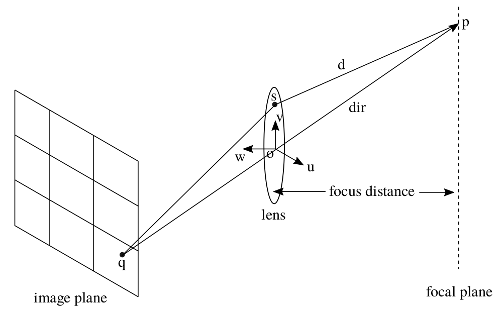
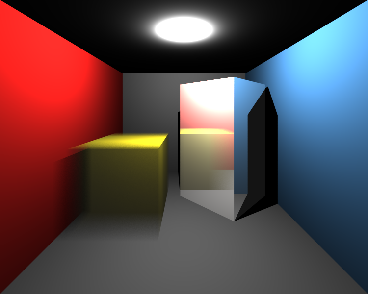

# Transformations, Instancing, Multisampling and the Distribution Ray Tracing

This section includes the experiences of implementing object transformations, instancing, multisampling and distribution ray tracing. The depth of field, Glossy reflections (imperfect mirrors) and translation motion blur is added to our ray tracing model.

# 1. Transformations

## Input
So, for new features new elements come to the input XML file. Transformations are given under the attribute same name. It can be scaling, translation or rotation. The first two ones are only 3D vectors, but rotation includes angle in degree and rotation vector as 3D vector, respectively. Any kind of object can be transformed via <Transformations> list under this attribute. These transformations are applied in the given order.

```markdown  
<Scene>
    <Transformations>
        <Translation id="1">0 -6 0</Translation>
        <Scaling id="1">3 0.1 0.1</Scaling>
        <Rotation id="2">0 0 1 0</Rotation>
    </Transformations>

    <Objects>
        <Mesh id="1">
            <Transformations>r1</Transformations>
        </Mesh>
        <Triangle id="1">
            <Transformations>s1</Transformations>
        </Triangle>
    </Objects>
</Scene>
```

## Code Design
I have used GLM library for all transformation and vector-matrix multiplications. Until this section, I have used my own vec3 class and its methods. Thus, I renewed the code pretty much by replacing all vectors.

Transformations are added to the Scene class as a list of string where the first character indicates the type of transformation and the remaining number is the identification number of the transformation. In order to speed the process, all matrix multiplications are done in preprocess and saved as a localMatrix and inverseLocalMatrix element to the Object class.  

## Algorithm
When implementing transformation, I transformed the ray by the inverse transformation matrix of the current object instead of transforming the objects. In other words, coming rays are firstly inversely transformed and then processed in the previous intersection tests of objects.

I plan to use the same things for Bounding Boxes. But, in preprocessing, bounding boxes are combined to a new bounding box. Thus, they must be in the same space to be added properly. Because of this reason, unfortunately, I could not apply the same methods for bounding boxes. In preprocessing, bounding boxes are created from the points of transformed objects and then, in intersection tests, the world ray is directly tested with them.

```markdown
Class Object
function intersect(ray, origin):
1. ray <- inverseLocalMatrix * ray;
2. origin = inverseLocalMatrix * origin;
3. apply remaining (in the previous part) intersection tests
```

## Implementation Process

Firstly, I planned to generate the following scene.

<p align="left"></p>

Of course, not everything was as easy as described above :D When I thought that I was doing everything perfectly as described above, I got the following result (left image).

<p float="left">
  
  
</p>

I realized that I forgot to normalize ray directions after these transformations. After that I got the result above (right). Now, the problem seemed to be related to shading because light directions don't look correct and the scene is too bright. I checked the shading function and realized that all shading operations are done via non-transformed ray. After coming from the intersection test, if the ray is intersected with an object, ray should be inversely transformed again for remaining shading operations. After fixing it, the results would be below (left).

<p float="left">
  
  
</p>

It is clearly seen that the spotlight is not in the correct direction because we need to transform the light direction to the inverse local space of the object, as well. After fixing related operations on shading function, I got the result in the above figure (right). But, there are some problems still. Shadows do not look like correctly. Yes, we have to re-transform intersection ray (with localMatrix of the object) to be sure that it is ready to intersect with other objects for shadow testing. The result can be seen in the following figure (left).

<p float="left">
  
  
</p>

The problematic intensity is divided by the correct distance between light source and hit point (in shading function). In addition, obviously, mesh normal vectors have some problems. After fixing the calculation of normal vectors, I got the correctly transformed result in the below.

<p align="left"></p>


# 2. Instancing

## Input
For the instancing part, instances are defined using the <MeshInstance> element. These objects are copied from the base mesh object with the given additional feature below.

```markdown  
<Scene>
    <MeshInstance id="5" baseMeshId="1" resetTransform="true">
        <Material>3</Material>
        <Transformations>r1 t3</Transformations>
    </MeshInstance>
</Scene>
```

## Code Design
I added a new class for mesh instances. In proprecessing, a new mesh object is created for each mesh instance. Its transformation matrix is generated according to the resetTransform element.

## Algorithm
I used the same vertex data for mesh instances by pointing them. By this way, we can prevent wasting redundant memory. After creating a new mesh object in preprocess, everything will be the same for ray tracing.

## Implementation Process

Below we can see the very first result of implementation of the mesh instances. The right green dragon will be generated by using the same vertices of the left dragon. Its transformation matrix and material are just different from the base mesh.

<p align="left"></p>

Note that models have some sprinkles. This effect will be improved by implementing the multisampling in the next part.

# 3. Multisampling

## Input

The third part, Multisampling is enabled by adding the <NumSamples> field to the Camera element.

```markdown  
<Scene>
    <NumSamples>N</NumSamples>
</Scene>
```

## Algorithm
With this feature, multiple small random samples for each pixel will be generated and filtered. I have used the average filter for final pixel color.

```markdown
function createScene():
1. for each camera
2.     initialize camera
3.     for each pixel
4.         color <- initialize
5.         for each sample
6.             generate random number inside the pixel
7.             compute ray direction by adding randomness
8.             color <- color + rayTracer(ray)
9.         color <- color / numberOfSamples
10.    write color information to the image file
```

## Implementation Process

Multi sampling gets more smooth edges as seen the example image below. Left images show the before than multisampling effect. It is a straightforward and I did not use any difficulties during its implementation.

<p float="left">
  
  
</p>

<p float="left">
  
  
</p>

# 4. Distribution Ray Tracing

## Input
The final part of this section is the Distribution Ray Tracing. This includes various visual effects with very little extra cost over multisampling. These effects are depth of field, glossy reflections and motion blur. Required elements for this part are given below.

```markdown  
<Scene>
    <FocusDistance>21</FocusDistance>
    <ApertureSize>1.5</ApertureSize>
    <MeshInstance id="1" baseMeshId="7" resetTransform="true">
        <MotionBlur>0 0 4</MotionBlur>
    </MeshInstance>
    <Material id="4" type="conductor">
        <Roughness>0.1</Roughness>
    </Material>    
</Scene>
```
The field of <FocusDistance> and <ApertureSize> will be used for the depth of field. We assume that there is a flat square lens on the aperture. Glossy reflections refer to imperfect mirrors. This is indicated by the presence of the <Roughness> element in the material attribute. <MotionBlur> will be used for the blurry appearance of fast moving objects. It is assumed to be only for translational movements. The <MotionBlur> element defines a final translation of the object during which the image capture was taking place.

## Algorithms

### Depth of Field
Real cameras have finite aperture as opposed to the pinhole model we have been using so far. Without a proper lens, a finite aperture camera is guaranteed to produce blurry images on its image plane. A lens is a glass contraption which allows focusing objects at a certain distance from it to a single point behind the lens. This is known as the focal or focus distance of the lens. Photographers typically put their main subject at this distance to create an effect where the subject is sharp but the background is blurry. In distributed ray tracing we can simulate this effect to make our renderings as if they are coming from a real camera (are taken from the notes of Assoc. Prof. Dr. Ahmet Oğuz Akyüz)

<p align="middle"></p>

It is so straightforward to implement as given below.

```markdown
function createScene():
1. for each camera
2.     initialize camera
3.     for each pixel
4.         color <- initialize
5.         for each sample
6.             generate random number inside the pixel
7.             ray.dir <- compute ray direction by adding randomness
8.             generate random values between [-0.5,0.5]
9.             dx, dy <- scale the random values to camera.apertureSize
10.            s <- camera.u*dx + camera.v*dy + camera.position;
11.            t <- camera.focusDistance / dot(ray.dir, -camera.w);
12.            p <- ray.dir*t + camera.pos as a ray.origin;
13.            ray.dir <- normalize(p - s);
14.            color <- color + rayTracer(ray)
15.        color <- color / numberOfSamples
16.   write color information to the image file
```

### Glossy reflections
This effect is generally used to simulate metallic objects that are not polished. Brushed metal is an example. It allows a reflection ray to be sent at an angle that is somewhat off from the perfect reflection direction. This effect again involves randomness (are taken from the notes of Assoc. Prof. Dr. Ahmet Oğuz Akyüz).

```markdown
function reflectionRay(ray, normal, roughness):
1. ray.dir <- compute reflection ray direction as previous sections
2. ray_prime <- ray.dir.copy()
3. axis <- argmin(abs(ray.dir))
4. ray_prime.axis <- 1
5. u <- normalize(cross(ray.dir, normalize(ray_prime.dir)))
6. v <- cross(ray.dir, u)
7. n1, n2 <- generate two random values between [-0.5,0.5]
8. ray.dir = normalize(ray.dir + roughness*(n1*u + n2*v))
```

### Motion Blur

 We can compute the Motion Blur effect by generating multiple rays in different times [0-1]. These ray times are generated initially and do not change while reflecting or refracting. Time 0 and 1 represent the initial and final positions of the object, respectively. A translation of a ray at any time in this interval is interpolated according to the motion vector. Note that this translation is independent from our transformation matrices in the previous part.

Only intersection tests of objects and bounding boxes are affected from motion blur as given below. I multiplied the origin of ray with the translation matrix of motion. Because we assumed that motion is done only by translation, ray direction cannot be changed by multiplying any translation matrix.

 ```markdown
 function intersect(ray, origin, rayTime):
 1. m <- compute translation matrix at rayTime by motionBlur vector
 2. m <- get inverse of m
 3. ray.origin <- m * ray.origin
 4. do intersection test with the ray
 ```

## Implementation Process

The before and after result of the Depth of Field effect can be seen below. But, there is still a problem with focusing area.

<p float="left">
  
  
</p>

The very first result of the Glossy Reflection is given below. Obviously, something was wrong on the left. Thanks to Alper Sahistan, I realized that my normalized random number n1 and n2 should be between -0.5 and 0.5 instead of 0 and 1. After that fix, I got the true result on the right.

<p float="left">
  
  
</p>

Let's see the result of motion blur. Firstly, I was confused about the order of transformation multiplications in the intersection tests. I mean that I could not decide to multiply ray with the inverse motion translation or inverse object transformations matrices. I tried the multiply ray with inverse motion translation matrix after transforming it to the object local world. But, as seen below (left), it was wrong for the given motion vector. Its effect would be too much if it is applied at non-local space. After changing the order I got the true result as seen right.

<p float="left">
  
  
</p>

## Final Results
Let's look at the final results of my implementation after all improving.

### cornellbox_boxes_dynamic.xml
<p align="left"></p>

```markdown
Is BHV acceleration used: 1
XML file is parsed in 0 sec
Maximum BVH depth is 4
Preprocessing is finished in 0 sec
Scene is created in 550 sec
```

### cornellbox_brushed_metal.xml
<p align="left"></p>

```markdown
Is BHV acceleration used: 1
XML file is parsed in 0 sec
Maximum BVH depth is 2
Preprocessing is finished in 0 sec
Scene is created in 147 sec
```

### dragon_dynamic.xml
<p align="left"></p>

```markdown
Is BHV acceleration used: 1
XML file is parsed in 3 sec
Maximum BVH depth is 20
Preprocessing is finished in 8 sec
Scene is created in 7320 sec
```

### metal_glass_plates.xml
<p align="left"></p>

```markdown
Is BHV acceleration used: 1
XML file is parsed in 0 sec
Maximum BVH depth is 4
Preprocessing is finished in 0 sec
Scene is created in 119 sec
```

### simple_transform.xml
<p align="left"></p>

```markdown
Is BHV acceleration used: 1
XML file is parsed in 0 sec
Maximum BVH depth is 1
Preprocessing is finished in 0 sec
Scene is created in 0 sec
```

### spheres_dof.xml
<p align="left"></p>

```markdown
Is BHV acceleration used: 1
XML file is parsed in 0 sec
Maximum BVH depth is 1
Preprocessing is finished in 0 sec
Scene is created in 21 sec
```

### tap_0200.xml
<p align="left"></p>

```markdown
Is BHV acceleration used: 1
XML file is parsed in 0 sec
Maximum BVH depth is 18
Preprocessing is finished in 0 sec
Scene is created in 806 sec
```

The running times of almost all of the examples were larger than I expected because many of them have huge numbers of sampling. Creating a single scene takes less than a second in many cases, but creating the same scene with 500 times more takes linearly increasing time.
