# Texture, Normal and Bump Mapping

This section includes the experiences of implementing the Texture Mapping, Normal and Bump Mapping. Smooth shading, Perlin Noise texture and Perlin Bump mapping is also implemented in this section.

In order to achieve these mapping, I firstly should have been able to read PNG and JPEG image files. We already have the LibPNG library to write a scene as a PNG file. In this section, I added the JPEG library given in [this code archive](https://code.google.com/archive/p/jpgd/). I will not give details about the reading image files here to keep the blog short, but I have spent some hours to achieve it. Firstly, I used the libjpeg, but I could not manage it to get the pixel successfully. Then, I switched the JPGD given above.

# 1. Texture Mapping

## Input
All kinds of textures are given under the <Textures> in the XML files. It has a list of images with their corresponding ID. Then, each texture map, <TextureMap>, will be given with map ID and type. Image type indicates the texture will be taken from the particular image file which is specified with its image ID at the list of images.

Texture can be added for several purposes (decalMode) such as blend_kd, replace_kd, replace_all, replace_background, replace_normal, bump_normal. The first four ones relate to color, directly while the last two ones affect the object normal vectors. They will be explained in the following sections. <Normalizer> field indicates the normalizing coefficient of the pixel colors. Generally, it will be 1 or 255 means use the RGB color directly or normalize it in the interval of 0-1, respectively. Its default value is 255 but it is expected to be 1 if the <decalMode> is replace_all or bump_normal.

Image pixels can be interpolated to the object in two ways which are bilinear or nearest interpolations. They will be explained in the following part, as well.

If an object covered by a texture is based on triangles, the corresponding texture coordinates of the vertices should be known. Thus, the XML file includes the corresponding texture coordinates under the <TexCoordData> field.

Once a <Textures> list is given, objects can have at most two textures (one for diffusion and one for normal mapping) from this list. These texture IDs are given in the <Textures> field of objects.

```markdown  
<Scene>
    <Textures>
        <Images>
            <Image id="1">textures/wall.png</Image>
        </Images>

        <TextureMap id="1" type="image">
            <ImageId>1</ImageId>
            <DecalMode>replace_kd</DecalMode>
            <Normalizer>255</Normalizer>
            <Interpolation>bilinear</Interpolation>
        </TextureMap>
    </Textures>

    <TexCoordData>
        1 1
        0 1
        ...
        1 0
    </TexCoordData>

    <Objects>
        <Mesh id="3">
            <Material>1</Material>
            <Textures>1</Textures>
            <Faces>
                13 9 14
                14 9 10
            </Faces>
        </Mesh>
    </Objects>
</Scene>
```

## Code Design
In this improvement, I added many classes and new features. Thus, I have changed the design pretty much.
New classes "TextureMap" and "Image" are implemented. These include the all new features given in the previous part. Object class will have new features, as well. Each object can have a textureDiffuse and/or textureNormal. These are determined according to the decalMode of the corresponding texture of the object. It decalMode belongs to the first set of decalMode, it is set as a textureDiffuse, otherwise, it will be considered as a textureNormal.

In addition, I changed my vertex approach, and created new class including all information related to the vertex.

```markdown
Class Vertex
    vec3 pos
    vec2 texCoord

Class Image
    int    width
    int    height
    int    component
    byte** data

Class TextureMap
    Image image
    mode  type
    mode  interpolation
    mode  decalMode
    float normalizer

    func init ()
    func getColor (texCoord)

Class Object
    TextureMap* textureDiffuse
    TextureMap* textureNormal
    int         textureOffset
    int         vertexOffset

    func getTextureColor (pHit)
```

## Algorithm
Firstly, assume that we already have the getTextureColor method of the object class. We can call it from the shading function and change the corresponding value according to the texture color as below.

```markdown
Class Scene
 func shading (object, ray, pHit, normal, rayTime):
 1. if object.textureDiffuse is not NULL:
 2.     if object.textureDiffuse.decalMode is "blend_kd":
 3.         kd <- (kd + object.getTextureColor(pHit)) / 2
 4.   
 5.     if object.textureDiffuse.decalMode is "replace_kd":
 6.         kd <- object.getTextureColor(pHit)
 7.    
 8.     if object.textureDiffuse.decalMode is "replace_all":
 9.         return object.getTextureColor(pHit)
10. ... // previously
```

We can employ getTextureColor to change the background color, as well.

```markdown
 func main ():
 1. ... // previously
 2.     for each output pixel:
 3.         ... // previously
 4.         color <- scene.raytracer(... &dist)
 5.  
 6.     if dist <= 0:       
 7.         if scene.textureBackground is not NULL:
 8.             texCoord <- vec2(i/camera.nx, j/camera.ny)
 9.             color <- scene.textureBackground.getColor(texCoord)
10.         else:
11.             color <- scene.backgroundColor
12. ... // previously
```

Let's compute the getTextureColor method and the others :D

Texture mapping is applied for triangles and spheres. To achieve it, we should firstly construct texture coordinates of the objects. The texture coordinates of the triangle can be computed by using the barycentric coefficients (alpha and beta) obtained from the object-ray intersection. For the sphere, the UV coordinates of the hit point is employed.

Note that I assumed that all sphere is a unit sphere such that their radius is one to simplify the most of the calculations. For this assumption, I used the scaling transformation we added in the previous section. Be careful when applying this scaling transformation. Firstly, the sphere should be translated to the center, then we should apply scaling, finally, it should be re-translate to its original location.

```markdown
Class Object
 func init ():
 1. if object type is sphere:
 2.     localMatrix = localMatrix * translate(center.position)
 3.     localMatrix = localMatrix * scale(radius)
 4.     localMatrix = localMatrix * translate(-center.position)

 func getTextureColor (pHit):
 1. if object type is triangle:
 2.     texCoord = (1-alpha-beta) * v1.texCoord \
 3.                + alpha * v2.texCoord \
 4.                + beta * v3.texCoord
 5. if object type is sphere:
 6.     phi = atan2(normal.z, normal.x)
 7.     theta = acos(normal.y, normal.x)
 8.     texCoord = ((PI-phi)/(2*PI), theta/PI)
 9.     return textureDiffuse->getColor(texCoord)
```

Once we get the corresponding texture coordinates, we can interpolate the image color to these coordinates as given below.

```markdown
Class TextureMap
 func getColor (texCoord):
 1. if interpolation is bilinear:
 2.     return getColorBilinear(texCoord)
 3. else:
 4.     return getColorNearest(texCoord)

 func getColorNearest (texCoord):
 1. find the nearest pixel to the given texCoord
 2. normalize the color according to the Normalizer
 3. return color

 func getColorBilinear (texCoord):
 1. find the nearest 4 pixels to the given texCoord
 2. interpolate them linearly by using their distance to the given texCoord
 3. normalize the color according to the Normalizer
 4. return color
```

## Implementation Process
I had some difficulties on the implementation, especially for spheres. Because my assumption on unit spheres, I had to transform them carefully as mentioned in the previous part.

Updated localMatrix (or object space matrix) is used to compute inverseLocalMatrix and the normalMatrix (as an inverse transformation of the local matrix).

I employed the normal vectors in world space (multiplied with the Normal Matrix) to compute the texture coordinates (see in the left). However, this approach was wrong. We need to use normals in object local space so that we can transform the object once we get the correct texture value (see in the right).

<p float="left">
  
  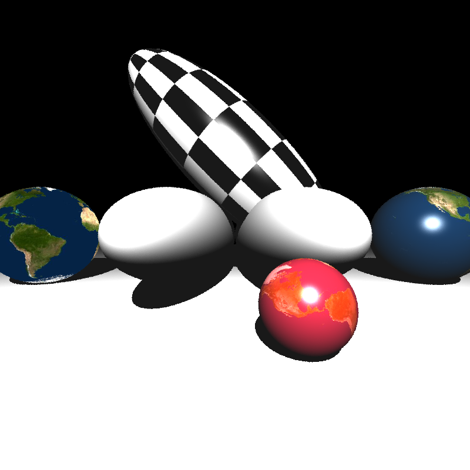
</p>

# 2. Perlin Noise

Perlin noise is a procedural texture primitive, a type of gradient noise used by visual effects artists to increase the appearance of realism in computer graphics (from Wikipedia).

## Input
In the XML file, Perlin Noise can be defined as a TextureMap whose type is "perlin" instead of "image". It includes <NoiseConversion> as a linear or absolute value (absval). The noise scale is aldo given the <NoiseScale> field.

```markdown  
<Scene>
    <Textures>
        <TextureMap id="1" type="perlin">
            <DecalMode>replace_kd</DecalMode>
            <NoiseConversion>linear</NoiseConversion>
            <NoiseScale>3</NoiseScale>
        </TextureMap>
    </Textures>
</Scene>
```

## Code Design
I implemented the Perlin Noise under the TextureMap class. Only the additional methods are given below.

```markdown
Class TextureMap
    char  noiseConversion
    float noiseScale
    int*  perlinNoise
    vec3* noiseGradient;

    func getPerlinNoise (pHit)
    func f (x)
    func w (x)
```

## Algorithm
We can reach the Perlin Noise color via getTextureColor method of the object. Note that I have called the getPerlinNoise method with the intersection point at the object local space for triangle only. For spheres, I used the intersection point at the world space. It does not matter and only changes the scale of the Perlin Noise. I have performed like that to get the same results with Prof. Oğuz Akyüz Hoca.

```markdown
Class Object
 func getTextureColor (pHit):
 1. if type of textureDiffuse is image:
 2.     ... // given in the texture mapping part
 3. if type of textureDiffuse is perlin:
 4.     point = pHit  
 5.     if object type is not sphere:
 6.         point = inverseLocalMatrix * pHit
 7.     return textureDiffuse->getPerlinNoise(pHit * textureDiffuse->noiseScale)
```

To get this noise, let's create the getPerlinNoise method of the TextureMap.  The implementation involves three steps: grid definition with random gradient vectors, computation of the dot product between the distance-gradient vectors and interpolation between these values.

```markdown
Class TextureMap
 func init ():
 1. define perlinNoise as a list of shuffled numbers in [0-15]
 2. define noiseGradient as a list of gradient vectors

 func f (x):
 1. return perlinNoise[x % 16]

 func w (x):
 1. get absolute value of x
 2. return 1 - (6*x^5 - 15*x^4 + 10*x^3)

 func getPerlinNoise (pHit):
 1. define a cube around the point by using floor and ceil functions
 2. noise <- 0
 3. for each corner point at this cube:
 4.     v <- pHit - corner  
 5.     e <- noiseGradient[f(corner.x + f(corner.y + f(corner.z)))]
 6.     noise <- noise + dot(e,v) * w(v.x) * w(v.y) * w(v.z);
 7. if noiseConversion is linear:
 8.     return (noise + 1) / 2
 9. if noiseConversion is absval:
 10.    return abs(noise)
```

## Implementation Process

I got some write defects previously (seen in the left). And, I realized it appears when at least one of the coordinates of the intersection point (hit point) is integer value. In such a case, its ceil and floor value would be the same and we could not construct a cube around the hit point. In order to improve it, I have increased one of the coordinates with one. It solves the problem as seen in the right.

<p float="left">
  
  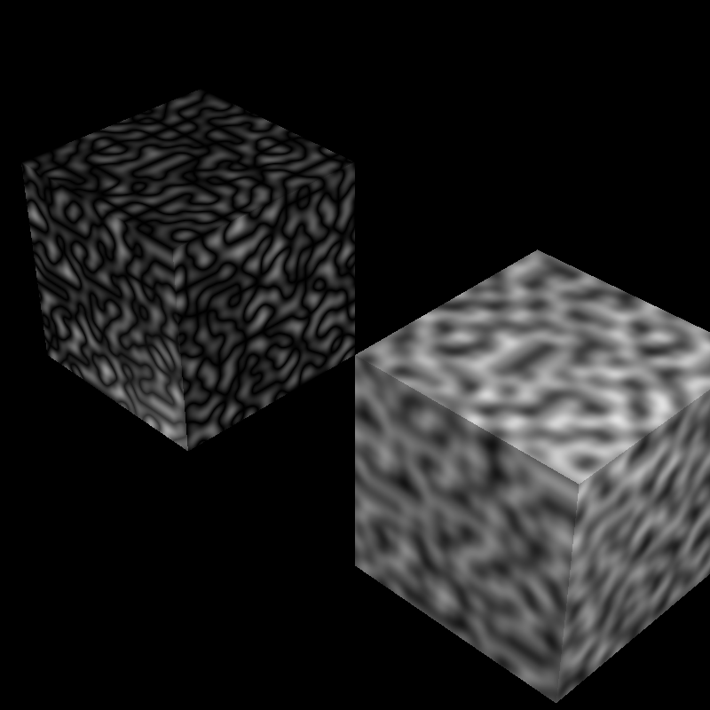
</p>

Please note that the left image is produced with the hit point at world space while the right one is from the object local space.

# 3. Normal Mapping
We can manipulate the normal vectors by using the texture value so that the objects look more realistic.

## Input
Normal mapping is applied if the DecalMode field of the TextureMap is replace_normal.

```markdown  
<Scene>
    <Textures>
        <TextureMap id="1" type="image">
            <DecalMode>replace_normal</DecalMode>
        </TextureMap>
    </Textures>
</Scene>
```

## Code Design
Each vertex can have its own normal vector. So, I have improved Vertex class by adding the normal vector.

The normal space obtained from the texture should be integrated to the object properly so that the texture normal will be suitable for each orientation of the object. In order to achieve it, texture normal should be transformed to the tangent space of the object. Thus, each object has a TBN matrix to transform a vector to the object tangent space.

```markdown
Class Vertex
    ...
    vec3 normal

Class Object
    ...
    mat3 tbnMatrix
```

## Algorithm
In normal mapping, a normal vector is extracted from the texture and transformed to the tangent space of the corresponding object. We need to get a normal vector from texture and compute the tangent space of the objects.

It is relatively easier to implement for triangles. The TBN matrix can be computed in preprocessing as given below.

```markdown
Class Object
 func init ():
 1. ... // previous implementations
 2. if the object type is triangle:
 3.         ... // previous implementations
 4.         if textureNormal is not NULL:
 5.             e1, e2 <- compute edge vector of triangles
 6.             E <- compute matrix from edges e1 and e2
 7.             A <- take the difference between texCoord of origin to the others
 8.             tbnMatrix <- inverse(A) * E
 9.     ...
10. return normalize(normalMatrix * normalPrime)
```

Once a TBN matrix of an object is constructed, it can be used in the normal calculations dynamically, as given below.

```markdown
Class Object
 func getNormal (pHit):
 1. if the object type is triangle:
 2.     if type of textureNormal is "image":
 3.         texCoord <- compute by using the barycentric coefficients
 4.         if decalMode of textureNormal is "replace_normal":
 5.             normalPrime <- textureNormal->getColor(texCoord) - vec3(0.5)
 6.             normalPrime <- tbnMatrix * normalize(normalPrime)
 7.     ...
 8. return normalize(normalMatrix * normalPrime)
```

We cannot compute the TBN matrix for spheres in preprocessing since it depends on the hit point. Thus, the TBN matrix of spheres is computed dynamically in the getNormal method of the object as below.

```markdown
Class Object
 func getNormal (pHit):
 1. if the object type is triangle:
 2.     ... // previous implementations
 3. if the object type is sphere:
 4.     phi <- atan2(normal.z, normal.x)
 5.     theta <- acos(normal.y, normal.x)
 6.     
 7.     tbnMatrix[0] <- vec3(normal.z * 2 * PI, 0, -normal.x * 2 * PI)
 8.     tbnMatrix[1] <- vec3(normal.y * cos(phi) * PI, \
 9.                          -sin(theta) * PI, \
10.                          normal.y * sin(phi) * PI)
11.     tbnMatrix[2] <- normal
12.     ...
13.     if type of textureNormal is "image":
14.         texCoord <- vec2((PI-phi)/(2*PI), theta/PI)
15.         if decalMode of textureNormal is "replace_normal":
16.             normalPrime <- textureNormal->getColor(texCoord) - vec3(0.5)
17.             normalPrime <- normalize(tbnMatrix) * normalize(normalPrime)
18.     ...
19. return normalize(normalMatrix * normalPrime)
```

## Implementation Process
In the implementation process of the sphere normals, I got firstly the result given in the left. After examining the code, I realized that the number of components in a pixel could be wrong in some cases at the reading of a PNG file. Once the pixel values are read correctly, I got the image seen in the right.

<p float="left">
  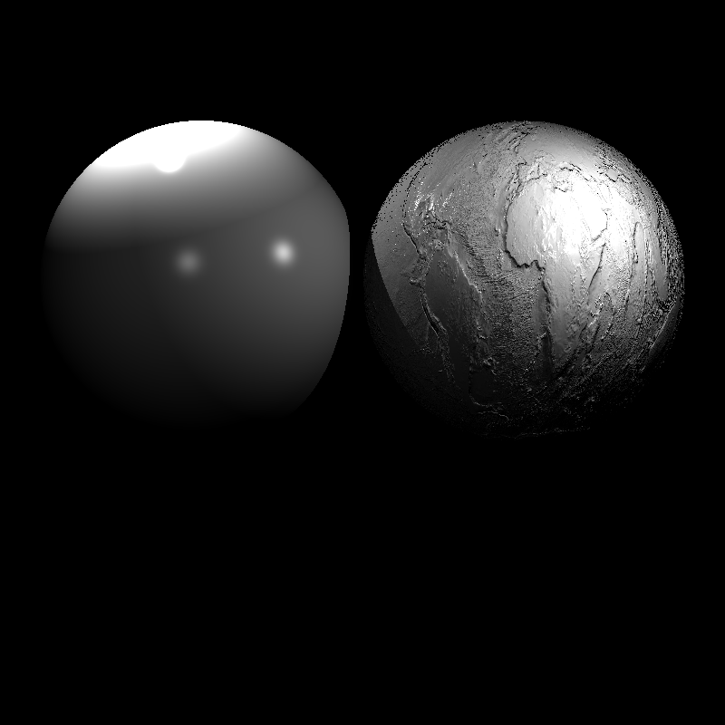
  
</p>

It was still incomplete. I added the TBN matrix transformation the texture normal so that the normals are arranged according the sphere surface (seen in the left). But its scale was too much. After adding the normalization, it fixed as given in the right.

<p float="left">
  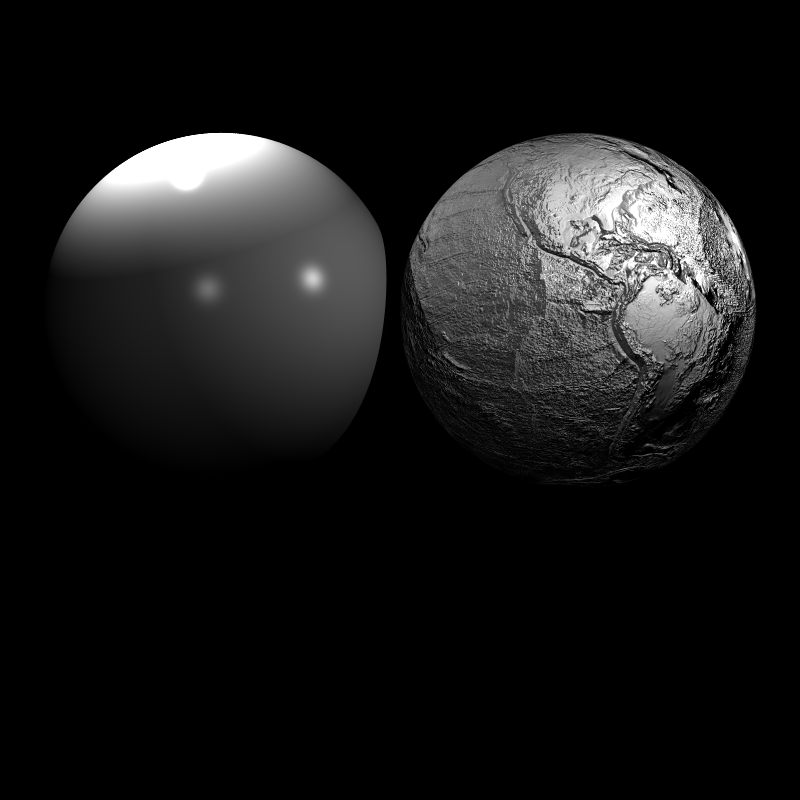
  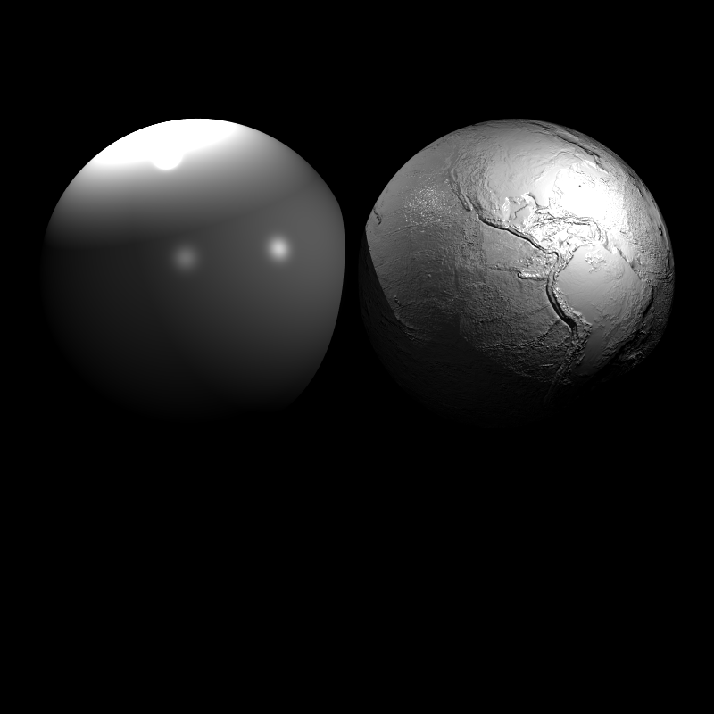
</p>

For triangles, I firstly did not define new normal for normalPrime and save the new results on the previous normal. But it affects the other parts of the code since I used these pure normals in the texture mapping. I created a new variable for re-computed normals (normalPrime) and the problem is solved. The wrong (left) and correct (right) usage can be seen below.

<p float="left">
  
  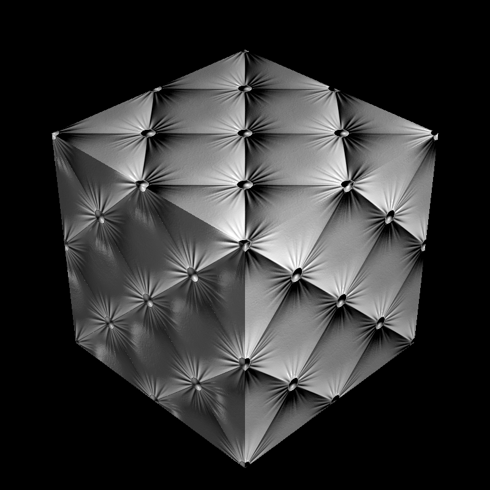
</p>

# 4. Bump Mapping
Bump mapping simulates the bumps or wrinkles in a surface without the need for geometric modifications to the model. In this part, we implement the Bump mapping on image and Perlin Noise textures.

## Input
Bump mapping is applied if the DecalMode field of the TextureMap is "bump_normal". Moreover, the field of <BumpFactor> is used to arrange the effects of the Bump mapping.

Note that Bump mapping can be applied on the both of "image" and "perlin" types of TextureMap.

```markdown  
<Scene>
    <Textures>
        <TextureMap id="1" type="image">
            <DecalMode>bump_normal</DecalMode>
            <BumpFactor>1</BumpFactor>
        </TextureMap>
        <TextureMap id="2" type="perlin">
            <DecalMode>bump_normal</DecalMode>
            <BumpFactor>5</BumpFactor>
        </TextureMap>
    </Textures>
</Scene>
```

## Code Design
TextureMap should be updated for new fields coming from the Bump mapping.

```markdown
Class TextureMap
    ...
    float bumpFactor

    func getBumpGradient (texCoord)
```

## Algorithm
The surface normal of a given surface is perturbed according to a bump map. The perturbed normal is then used instead of the original normal. We perturb the normal by using small steps towards new surface. For this purposes, we should compute the change (gradient) from the original surface to the bump surface.

```markdown
Class Object
 func getBumpGradient (texCoord):
 1. c0 <- get color from the texCoord
 2. c1 <- get color from the texCoord by increasing i index by 1
 3. c2 <- get color from the texCoord by increasing j index by 1
 4.
 5. l0 <- take average of the color c0
 6. l1 <- take average of the color c1
 7. l2 <- take average of the color c2
 8.
 9. return bumpFactor * vec2(l1-l0, l2-l0)
```

Once gradient is computed, we can use it in the computation of new normals.

```markdown
Class Object
 func getNormal (pHit):
 1. if the object type is triangle:
 2.     if type of textureNormal is "image":
 3.         texCoord <- compute by using the barycentric coefficients
 4.         ... // previously
 4.         if decalMode of textureNormal is "bump_normal":
 5.             grd <- textureNormal->getBumpGradient(texCoord)
 6.             qu <- tbnMatrix[0] + grd.s * normal;
 7.             qv <- tbnMatrix[1] + grd.t * normal;
 6.             normalPrime <- normalize(cross(qv, qu))
 7.     ...
 8. return normalize(normalMatrix * normalPrime)
```

Note that I used the non-normalized TBN matrix to keep the small changes in corresponding direction.

## Implementation Process

The Bump mapping should be implemented very carefully. Any small mistake on calculation causes a big problem on the generated scene. I got the result on the left for a long time. The solving process was too complicated to be recorded for me. I changed many things, and their combinations, again and again. I think this section of the implementing the Advance Ray Tracer was the most challenging one until now.

I stuck in the image seen on the left for a long time. After ending my implementation described above, it is solved as given in the right.

<p float="left">
  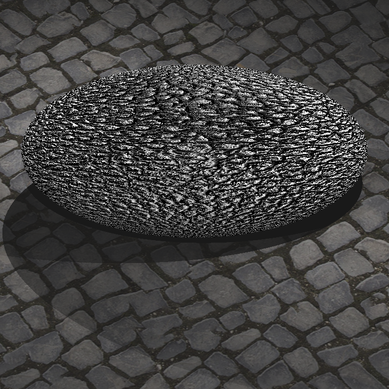
  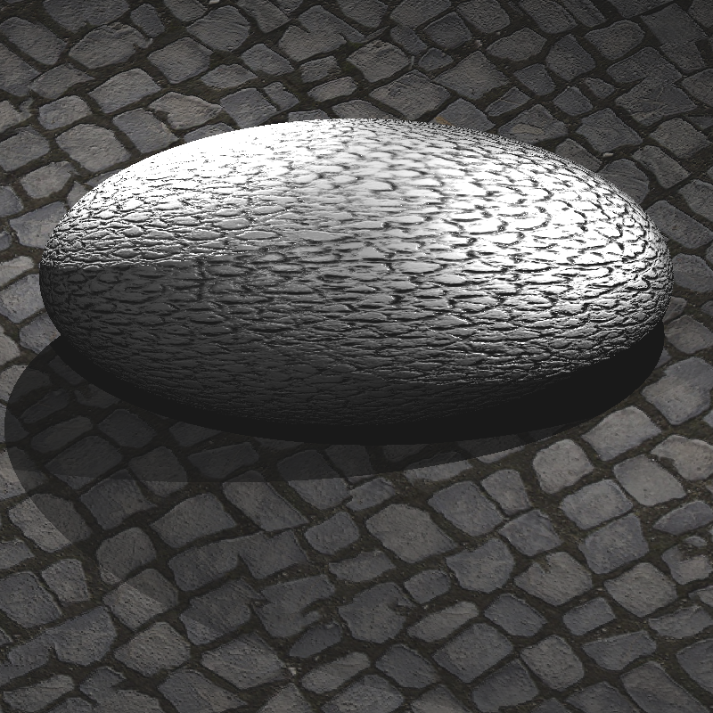
</p>

<p float="left">
  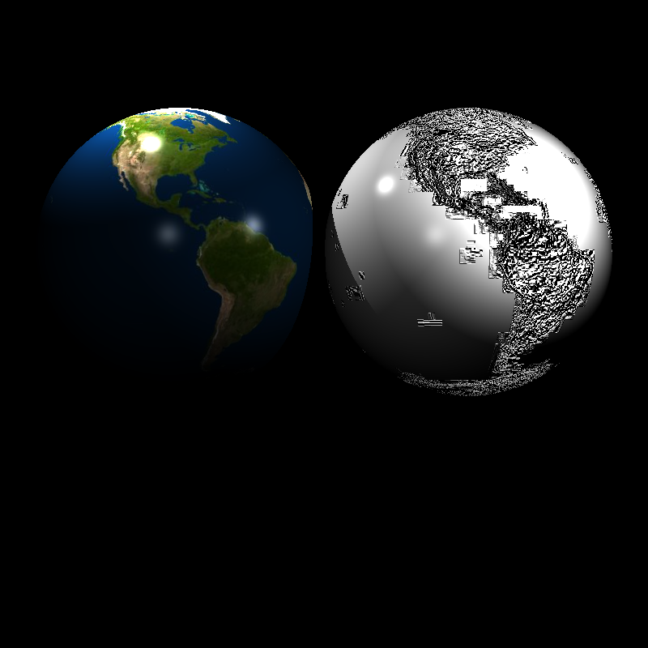
  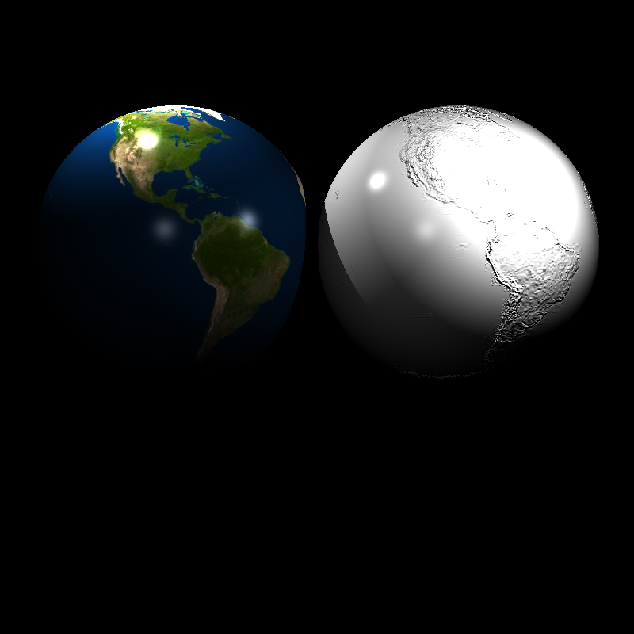
</p>


## Other Improvements (Smooth Shading)
In this section of the implementing Advance Ray Tracer, I added smooth shading. It takes the weighted average of the normal of the vertices of a triangle. If the vertices of a triangle do not have their own normal vector, it can be computed by taking the average of the triangles shared by the same vertex. It was pretty straightforward when we have the barycentric coefficients as given below.

```markdown
Class Object
 func getNormal (pHit):
 1. if the object type is triangle:
 2.     if smooth shading is active:
 3.         normalPrime <- normalize((1-alpha-beta) * v1.normal \
 4.                                   + alpha * v2.normal \
 5.                                   + beta * v3.normal)
 6.     ...
 7. return normalize(normalMatrix * normalPrime)
```

<p float="left">
  
  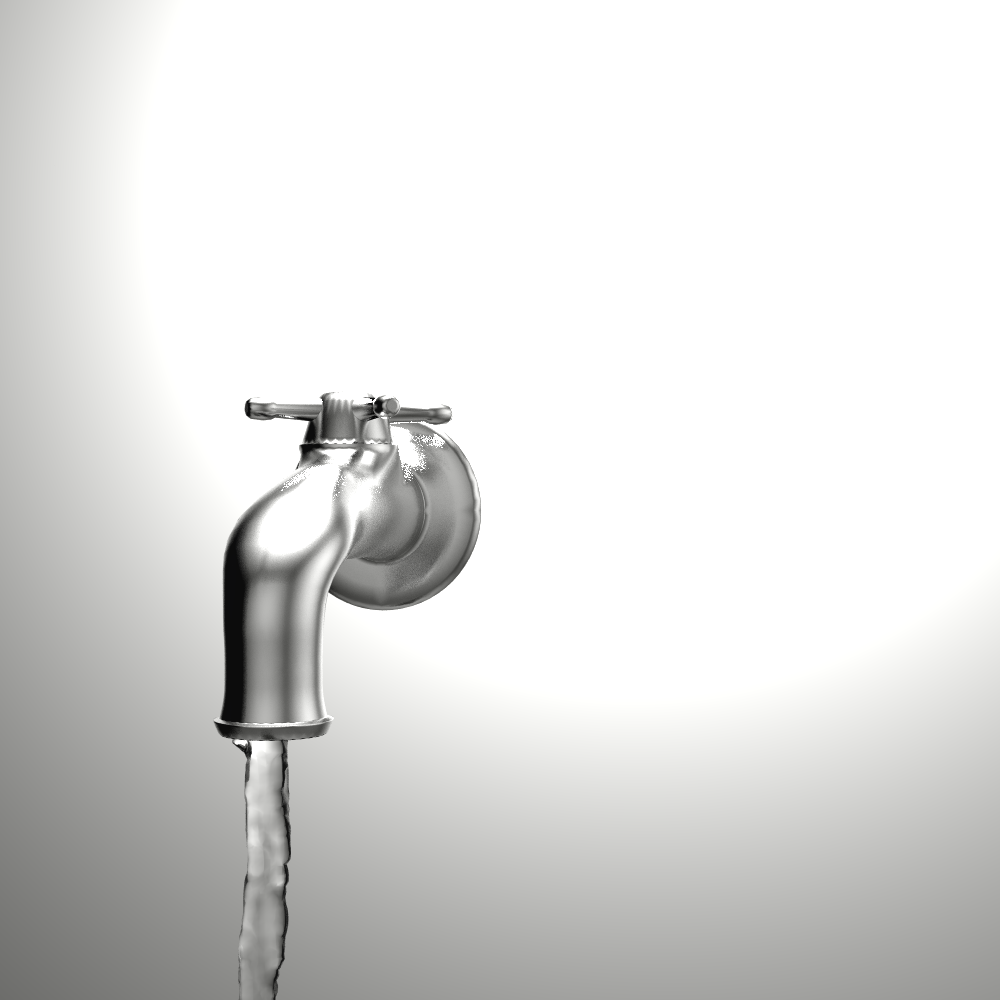
</p>

## Final Results
Let's look at the final results of my implementation after all improving.

### bump_mapping_transformed.xml
<p align="left"></p>
```markdown
XML file is parsed in 0 sec
Maximum BVH depth is 1
Preprocessing is finished in 0 sec
Scene is created in 1 sec
```

### cube_cushion.xml
<p align="left"></p>
```markdown
XML file is parsed in 1 sec
Maximum BVH depth is 1
Preprocessing is finished in 0 sec
Scene is created in 0 sec
```

### cube_perlin_bump.xml
<p align="left">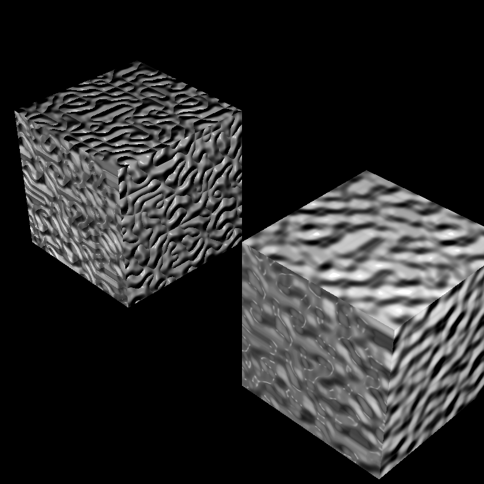</p>
```markdown
XML file is parsed in 0 sec
Maximum BVH depth is 1
Preprocessing is finished in 0 sec
Scene is created in 1 sec
```

### cube_perlin.xml
<p align="left"></p>
```markdown
XML file is parsed in 0 sec
Maximum BVH depth is 1
Preprocessing is finished in 0 sec
Scene is created in 1 sec
```

### cube_wall_normal.xml
<p align="left"></p>
```markdown
XML file is parsed in 0 sec
Maximum BVH depth is 1
Preprocessing is finished in 0 sec
Scene is created in 1 sec
```

### cube_wall.xml
<p align="left">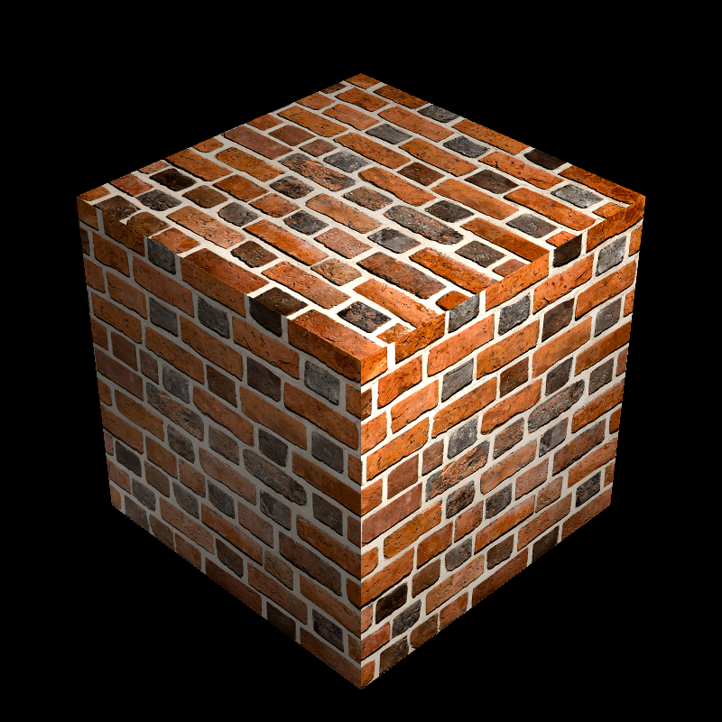</p>
```markdown
XML file is parsed in 0 sec
Maximum BVH depth is 1
Preprocessing is finished in 0 sec
Scene is created in 1 sec
```

### cube_waves.xml
<p align="left">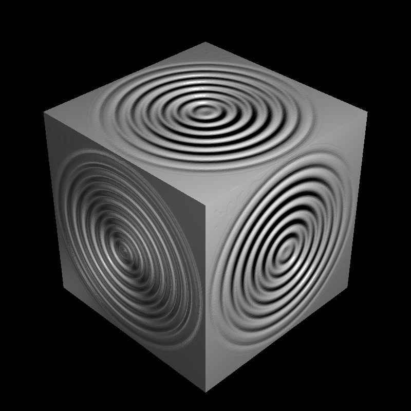</p>
```markdown
XML file is parsed in 0 sec
Maximum BVH depth is 1
Preprocessing is finished in 0 sec
Scene is created in 1 sec
```

### ellipsoids_texture.xml
<p align="left">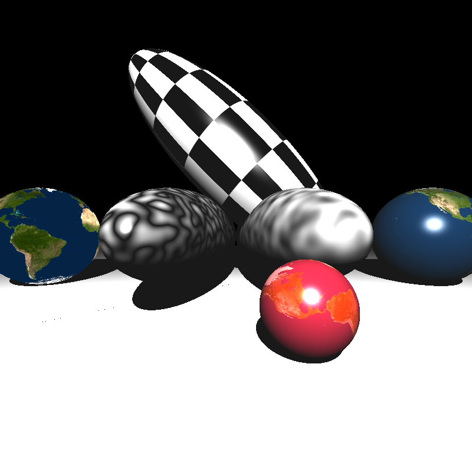</p>
```markdown
XML file is parsed in 0 sec
Maximum BVH depth is 1
Preprocessing is finished in 0 sec
Scene is created in 0 sec
```

### galactica_dynamic.xml
<p align="left">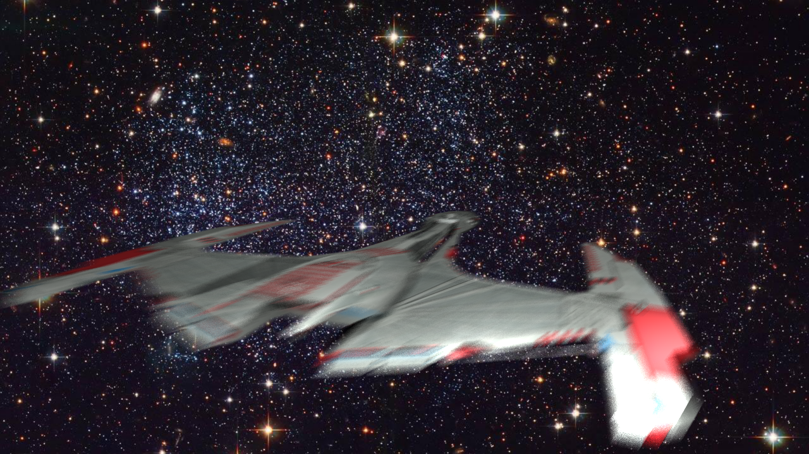</p>
```markdown
XML file is parsed in 0 sec
Maximum BVH depth is 10
Preprocessing is finished in 0 sec
Scene is created in 204 sec
```

### galactica_static.xml
<p align="left">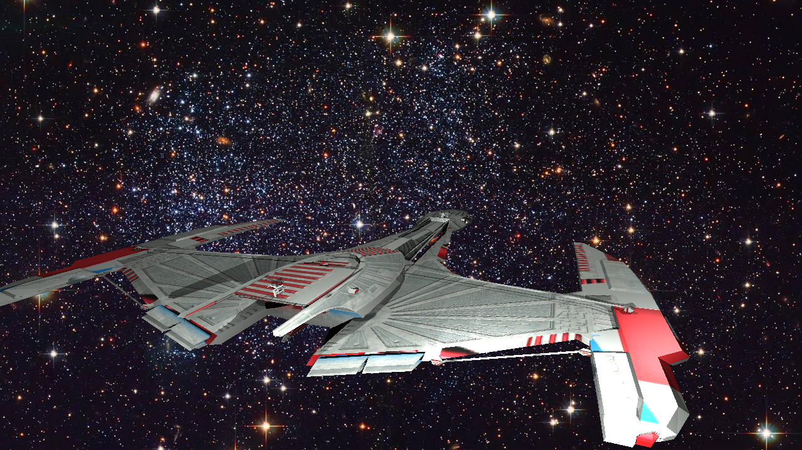</p>
```markdown
XML file is parsed in 0 sec
Maximum BVH depth is 10
Preprocessing is finished in 0 sec
Scene is created in 3 sec
```

### killeroo_bump_walls.xml
<p align="left">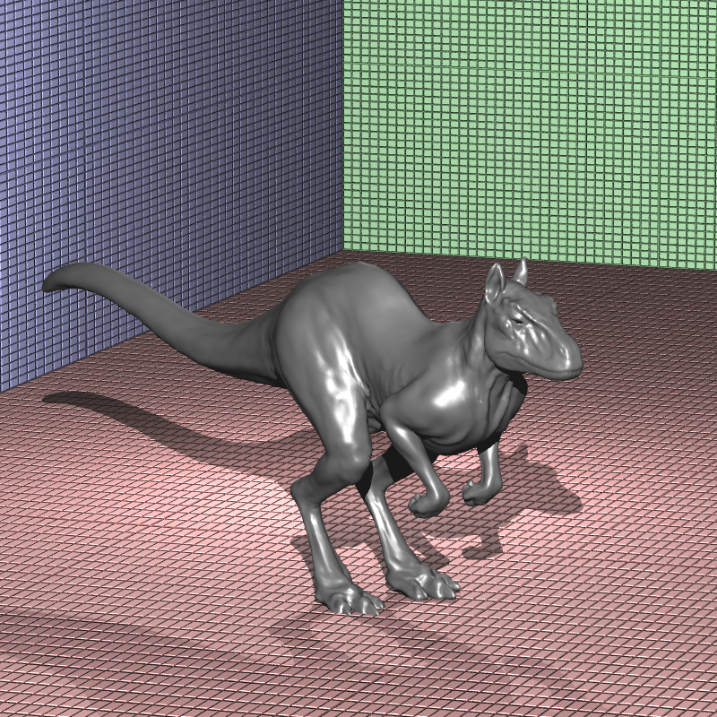</p>
```markdown
XML file is parsed in 0 sec
Maximum BVH depth is 15
Preprocessing is finished in 1 sec
Scene is created in 33 sec
```

### sphere_nearest_bilinear.xml
<p align="left">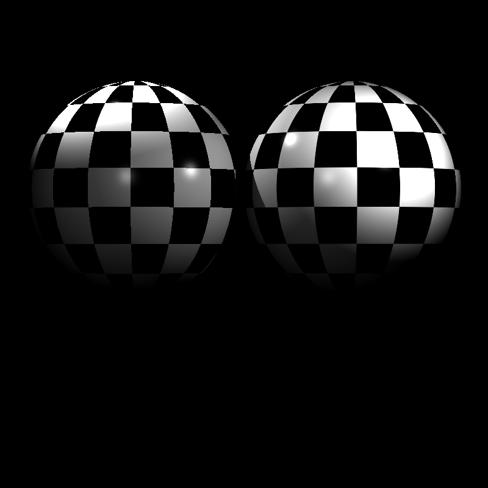</p>
```markdown
XML file is parsed in 0 sec
Maximum BVH depth is 1
Preprocessing is finished in 0 sec
Scene is created in 0 sec
```

### sphere_nobump_bump.xml
<p align="left">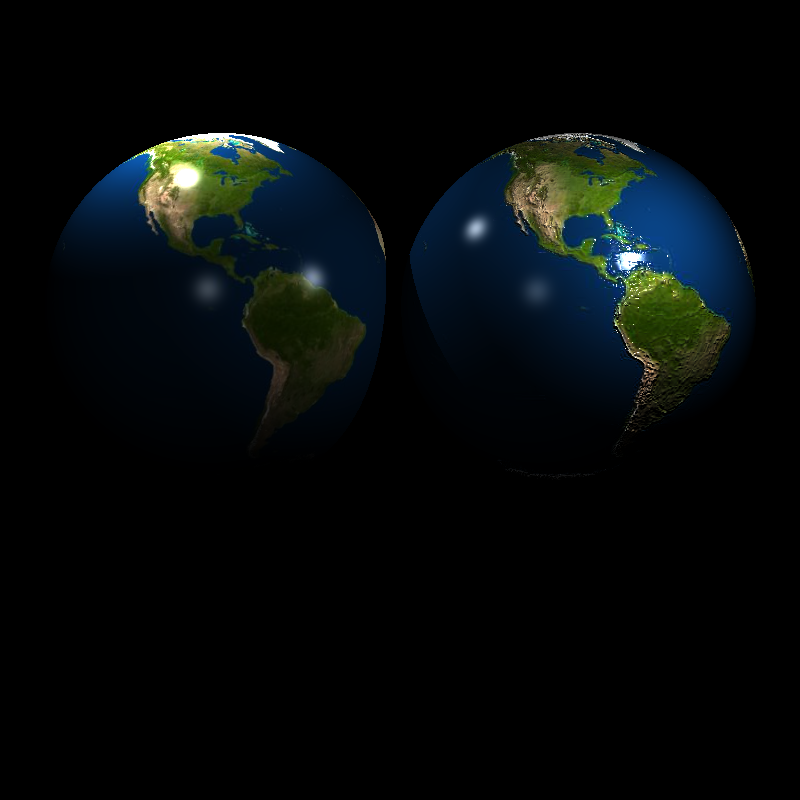</p>
```markdown
XML file is parsed in 0 sec
Maximum BVH depth is 1
Preprocessing is finished in 0 sec
Scene is created in 0 sec
```

### sphere_nobump_justbump.xml
<p align="left"></p>
```markdown
XML file is parsed in 0 sec
Maximum BVH depth is 1
Preprocessing is finished in 0 sec
Scene is created in 0 sec
```

### sphere_normal.xml
<p align="left"></p>
```markdown
XML file is parsed in 0 sec
Maximum BVH depth is 1
Preprocessing is finished in 0 sec
Scene is created in 30 sec
```

### sphere_perlin_bump.xml
<p align="left">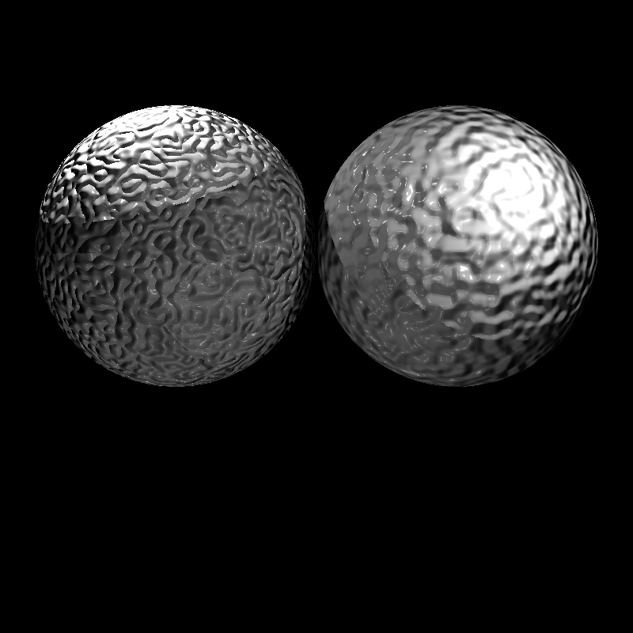</p>
```markdown
XML file is parsed in 0 sec
Maximum BVH depth is 1
Preprocessing is finished in 0 sec
Scene is created in 0 sec
```

### sphere_perlin_scale.xml
<p align="left">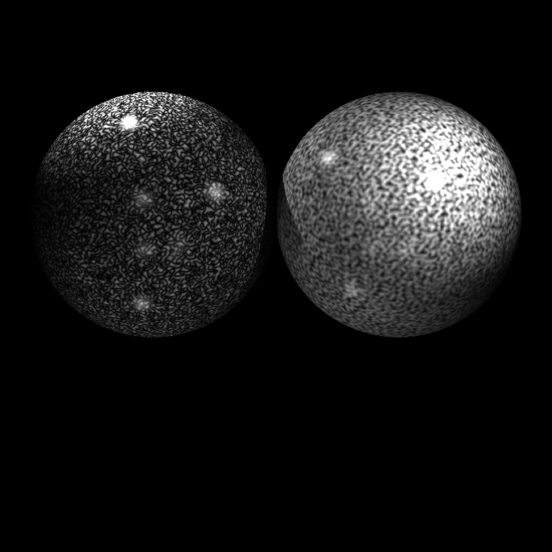</p>
```markdown
XML file is parsed in 0 sec
Maximum BVH depth is 1
Preprocessing is finished in 0 sec
Scene is created in 1 sec
```

### sphere_perlin.xml
<p align="left">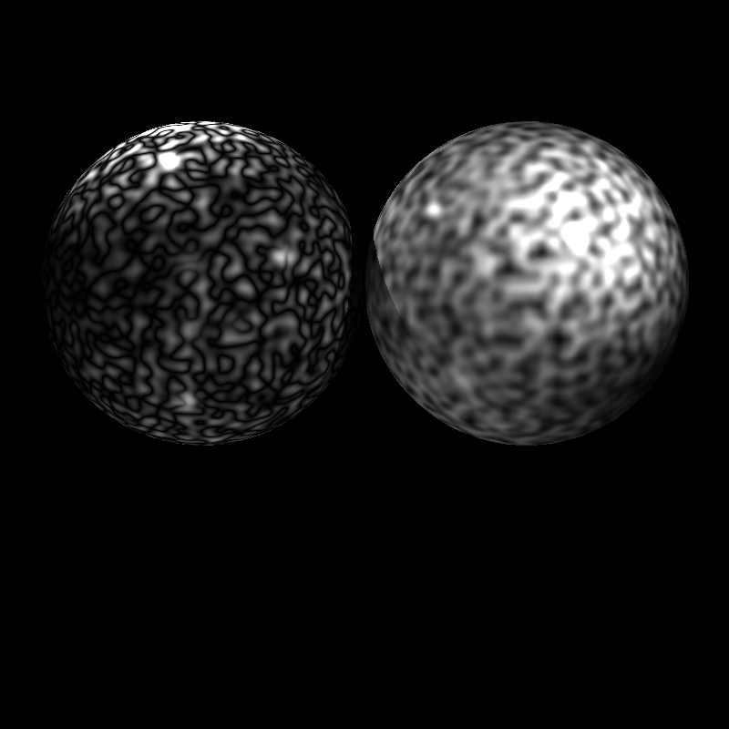</p>
```markdown
XML file is parsed in 0 sec
Maximum BVH depth is 1
Preprocessing is finished in 0 sec
Scene is created in 0 sec
```

### tap_0200.xml
<p align="left"></p>
```markdown
XML file is parsed in 0 sec
Maximum BVH depth is 17
Preprocessing is finished in 0 sec
Scene is created in 360 sec
```
