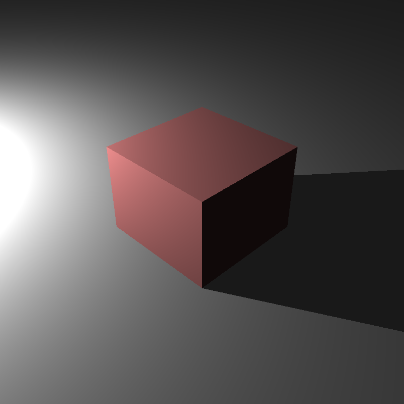

# HDR Imaging and Advanced Lighting

This section includes the experiences of implementing the advanced
lighting and HDR imaging support.

In order to achieve these mapping, we need to be able to read and write HDR images in EXR format. I added the TinyEXR library in [the GitHub repo](https://github.com/syoyo/tinyexr). In order to create a HDR image, we just need to write the float pixel values without clamping in EXR format.

# 1. Tone Mapping

## Input
Tone mapping features are given in the new field <Tonemap>. Our ray tracer will support Photographic Tone Mapping which is specified in the field of <TMO>. The options of tonemap algorithm are given in the <TMOOptions>. For the Photographic Tone Mapping, the first value is the image key value explained in [the paper](https://odtuclass.metu.edu.tr/pluginfile.php/413863/mod_resource/content/2/hdr_photographic.pdf) by Reinhard et. al. The second value is the percent of pixels to be burned. L_white specified in the paper is computed from this by sorting the pixels with respect to their luminance, then computing the given percentile. The luminance in this percentile will be used as L_white. The field of <Saturation> indicates how colorful we want the final image to be. Finally, <Gamma> is the parameter of the Gamma Correction algorithm.

```xml  
<Scene>
    <Cameras>
        <Camera id="1" type="lookAt">
            <Tonemap>
                <TMO>Photographic</TMO>
                <TMOOptions>0.18 1</TMOOptions>
                <Saturation>1.0</Saturation>
                <Gamma>2.2</Gamma>
            </Tonemap>
        </Camera>
    </Cameras>
</Scene>
```

## Code Design
The Camera class will get new methods as given below.

```c
Class Camera
    ...
    bool   tonemap
    vec2   tmoOptions
    float  saturation
    float  gamma
```

## Algorithm
Tone mapping is applied just before writing the float pixel values as a HDR image. I follow the [Reinhard Photographic Tone Mapping algorithm](https://odtuclass.metu.edu.tr/pluginfile.php/413863/mod_resource/content/2/hdr_photographic.pdf) as given below.

```c
Class Scene
 func toneMapping (camera):
 1. lum_in <- convert the pixel_color to luminance
 2. // Equation 1
 3. lum_w_hat <- the summation of the log luminance with small epsilon
 4. lum_w_hat <- exp(lum_w_hat / n)
 5. // Equation 2
 6. lum_scaled <- camera.key_value * lum_in / lum_w_hat
 7. sorted_lum_scaled <- sort(lum_scaled)
 8. lum_white <- sort(lum_scaled)[(n-1) * (100-camera.burnPercent) / 100]
 9. // Equation 4
10. lum_d <- lum_scaled * (1 + lum_scaled / (lum_white*lum_white)) / (1+lum_scaled)
11. rgb = lum_d * pow((pixel_color / lum_in), camera.saturation)
12. color = pow(rgb, 1 / camera.gamma) * 255
13. return color
```

Finally, we can write the tone mapped color in EXR format.

## Implementation Process
We got the scene on the left without tone mapping. In my first tries, the ray tracer produced the scene in the right. It includes the pale cube and the burning did not look correct.

<p float="left">
  
  
</p>

Then, I realized that I computed the white luminance (lum_white) by using the initial luminance (lum_in) instead of scaled ones. After fixing it, I got the scene on the left. The environment looked correct but the cube was still pale. Finally, I applied the degamma method to the material of the cube so that the cube looks more colorful as given in the right.

<p float="left">
  
  
</p>


# 2. Advance Lighting

This section includes the implementation of point light, area light, directional light, spherical directional (environment) light and finally spot light.

## Input
Lights' features are defined in the XML file as below.

```xml  
<Scene>
    <Lights>
        <AmbientLight>7.5 7.5 7.5</AmbientLight>
        <PointLight id="1">
            <Position> -4.4391 1.50656 -4.44377</Position>
            <Intensity>1000 1000 1000</Intensity>
        </PointLight>
        <AreaLight id="1">
            <Position>0 9.8 2</Position>
            <Normal>0 -1 0</Normal>
            <Size>3</Size>
            <Radiance>150000 150000 150000</Radiance>
        </AreaLight>
        <DirectionalLight id="1">
            <Direction>1 -0.8 -1</Direction>
            <Radiance>200 200 200</Radiance>
        </DirectionalLight>
        <SphericalDirectionalLight id="1">
            <ImageId>2</ImageId>
        </SphericalDirectionalLight>
        <SpotLight id="1">
            <Position>-0.93 1 0.9</Position>
            <Direction>1 -1 -1</Direction>
            <Intensity>600 600 600</Intensity>
            <CoverageAngle>10</CoverageAngle>
            <FalloffAngle>8</FalloffAngle>
        </SpotLight>
    </Lights>
</Scene>
```

## Code Design
Light class is extended with new features and methods.

```c
Class TextureMap
    vec3  position
    vec3  intensity
    vec3  normal
    vec3  radiance
    vec3  direction
    vec3  spotDirection
    vec3  u, v
    float coverageAngle
    float falloffAngle
    float size
    int   imageID
    int   type      //0:PointLight,
                    //1:AreaLight,
                    //2:DirectionalLight,
                    //3:SphericalDirectionalLight
                    //4:SpotLight
    TextureMap* texture

    func getDirection(pHit, obj_normal)
    func illuminance(ray, obj_normal, obj_material)
```

## Algorithm
All lighting features are combined in the light class and will be explained in the coming parts. Before that, let's examine the lighting methods called from our basic shading function as below. Here the difference from the previous sections, shadow can be checked for the lights coming from the infinity such as directional and Spherical directional lights. In these kinds of lights, our light direction will be a normalized vector so that we cannot check the shadow distance in the range of [0-1]. Instead, we can check the shadow by looking at the positive intersection distance. In order to switch this feature, I send a new boolean flag, inf, to the isShadow function.


```c
Class Scene
 func shading (object, ray, pHit, normal):
 1. ... // previously
 2. for each light in lights:
 3.     direction <- light.getDirection(pHit, normal)
 4.     origin <- pHit + normal*shadowRayEpsilon
 5.     inf <- lights.isDirectional() ? true : false
 6.     shadowRay <- Ray(direction, origin)
 7.     shadow <- isShadow(object, shadowRay, inf)
 8.     if (!shadow):
 9.         color <- color + lights.illuminance(ray, normal, material)
10. return color
```

## 1. Point Light
Radiance of the point light can be computed by dividing the intensity to the distance between hit point and the light source. After finding the radiance all shading functions can be applied.

```c
Class Light
 func getDirection (pHit, normal):
 1. ... // previously
 2. if type is PointLight:
 3.     light.direction <- light.position - pHit
 4. return light.direction

Class Light
 func illuminance (ray, normal, material):
 1. ... // previously
 2. if type is PointLight:
 3.     radiance <- light.intensity / dot(direction, direction)
 4. ... // shading operations
 5. return color
```

## 2. Area Light
In the area light, we generate a random point in the plane light. This point will represent the whole light. Thus, we can compute the direction from this point to the hit_point of the object. Note that this direction should be not normalized to compute the shadow correctly.

```c
Class Light
 func getDirection (pHit, normal):
 1. ... // previously
 2. if type is AreaLight:
 3.     x <- generate a number in [-0.5, 0.5]
 4.     y <- generate a number in [-0.5, 0.5]
 5.     point <- x*light.size*light.u + y*light.size*light.v + light.position
 6.     light.direction <- point - pHit
 7. return light.direction
 ```

Once getting the direction of the light, we can compute the declination by looking at the angle between the normal of the light source and the light direction to the object. In order to compute the radiance, we need to multiply the light intensity with the integral of the area. Note that, we choose a point to represent the whole light source.

```c
Class Light
 func illuminance (ray, normal, material):
 1. ... // previously
 2. if type is AreaLight:
 3.     declination <- dot(normal, normalize(-light.direction))
 4.     // flip the normal if it is in the opposite direction
 5.     if declination < 0:
 6.         declination <- max(dot(-normal, normalize(-direction)), 0)
 7.     area <- light.size * light.size
 8.     distance <- dot(light.direction, light.direction)
 9.     radiance <- light.intensity * area * declination / distance
10. ... // shading operations
11. return color
```

## 3. Directional Light
Directional lights have a direction with a radiance and they come from infinity. Thus, we just send its direction in the getDirection method.

```c
Class Light
 func getDirection (pHit, normal):
 1. ... // previously
 2. if type is DirectionalLight:
 3.     return light.direction
```

Similarly, we don't need to compute the radiance. Instead, we just use the given radiance of the light in the shading.

```c
Class Light
 func illuminance (ray, normal, material):
 1. ... // previously
 2. if type is DirectionalLight:
 3.     radiance <- light.radiance
 4. ... // shading operations
 5. return color
```

## 4. Spherical Directional (Environment) Light
In spherical directional light, we generate a vector in the upper hemisphere. This vector will represent the light direction.

```c
Class Light
 func getDirection (pHit, normal):
 1. ... // previously
 2. while true:
 3.     if type is SphericalDirectionalLight:
 4.         x <- generate a number in [-1, 1]
 5.         y <- generate a number in [-1, 1]
 6.         z <- generate a number in [-1, 1]
 7.         direction <- Direction(x, y, z)
 8.         if dot(direction, direction) <= 1 and dot(direction, normal) > 0:
 9.             light.direction <- normalize(direction)
10.             break
11. return light.direction
```

We have used the light direction to get the radiance value from the lighting texture. Note that this radiance is just from the one sample and should be generalized (i.e. getting the expected value of the radiance) by multiplying the probability as below.

```c
Class Light
 func illuminance (ray, normal, material):
 1. ... // previously
 2. if type is SphericalDirectionalLight:
 3.     texCoord.s <- 0.5 - atan2(direction.z, direction.x) * (1 / 2 PI)
 4.     texCoord.t <- acosf(direction.y) * (1 / PI)
 5.     radiance <- light.texture->getColor(texCoord) * 2 * PI
 6. ... // shading operations
 7. return color
```

## 5. Spot Light
Spot light has its own direction as given below so that we can just send its direction in the getDirection method.

```c
Class Light
 func getDirection (pHit, normal):
 1. ... // previously
 2. if type is SpotLight:
 3.     return light.direction
 ```

Spot lights have different radiance in three conditions. The radiance will be the same as the radiance of point light when the angle between the direction from the object and the original direction of the spotlight is less than half of the falloff angle. It decreases its radiance outside of this angle until half of the coverage angle. Finally, outside of the coverage angle, the radiance will be zero.

```c
Class Light
 func illuminance (ray, normal, material):
 1. ... // previously
 2. if type is SpotLight:
 3.     dir1 <- normalize(light.spotDirection)
 4.     dir2 <- normalize(-light.direction)
 5.     declination <- acos(dot(dir1, dir2));
 6.     if declination < falloffAngle / 2:
 7.         radiance <- intensity / dot(light.direction, light.direction)
 8.     else if declination < coverageAngle / 2:
 9.         radiance <- intensity / dot(light.direction, light.direction)
10.         radiance <- radiance * pow((cos(declination) - cos(coverageAngle/2))
11.         radiance <- radiance / (cos(falloffAngle/2.) - cos(coverageAngle/2)), 4)
12.     else:
13.         radiance <- 0
14. ... // shading operations
15. return color
```

## Implementation Process
I faced some problems by implementing the area light. In my first implementation, I miscalculated the direction of the lights as given in the left. After fixing the light direction, I used the object normal instead of the normal of the light source in the computation of declination by accident (in the right).

<p float="left">
  
  
</p>

However, fixing this problem led to losing the light source in the scene. I realized that using the light normal in one direction causes to not illumination on the object placed in the other direction (e.g. the upper plane of the box). This can be seen in the left image. In order to fix it, I flipped the normal of the light for this kind of object. Finally, the correct scene is shared in the right.

<p float="left">
  
  
</p>


## Final Results
Let's look at the final results of my implementation after all improving.

### cornellbox_area.xml
<p align="left"></p>
```markdown
XML file is parsed in 0 sec
Maximum BVH depth is 1
Preprocessing is finished in 0 sec
Scene is created in 62 sec
```

### cube_directional.xml
<p align="left"></p>
```markdown
XML file is parsed in 1 sec
Maximum BVH depth is 1
Preprocessing is finished in 0 sec
Scene is created in 0 sec
```

### cube_point.xml
<p align="left"></p>
```markdown
XML file is parsed in 0 sec
Maximum BVH depth is 1
Preprocessing is finished in 0 sec
Scene is created in 1 sec
```

### cube_point_hdr.xml
<p align="left"></p>
```markdown
XML file is parsed in 0 sec
Maximum BVH depth is 1
Preprocessing is finished in 0 sec
Scene is created in 1 sec
```

### dragon_spot_light_msaa.xml
<p align="left"></p>
```markdown
XML file is parsed in 4 sec
Maximum BVH depth is 19
Preprocessing is finished in 31 sec
Scene is created in 141 sec
```

### head_env_light.xml
<p align="left"></p>
```markdown
XML file is parsed in 1 sec
Maximum BVH depth is 12
Preprocessing is finished in 0 sec
Scene is created in 1395 sec
```

### sphere_point_hdr_texture.xml
<p align="left"></p>
```markdown
XML file is parsed in 0 sec
Maximum BVH depth is 1
Preprocessing is finished in 0 sec
Scene is created in 1 sec
```

### VeachAjar.xml
<p align="left"></p>
```markdown
XML file is parsed in 0 sec
Maximum BVH depth is 19
Preprocessing is finished in 1 sec
Scene is created in 234 sec
```
