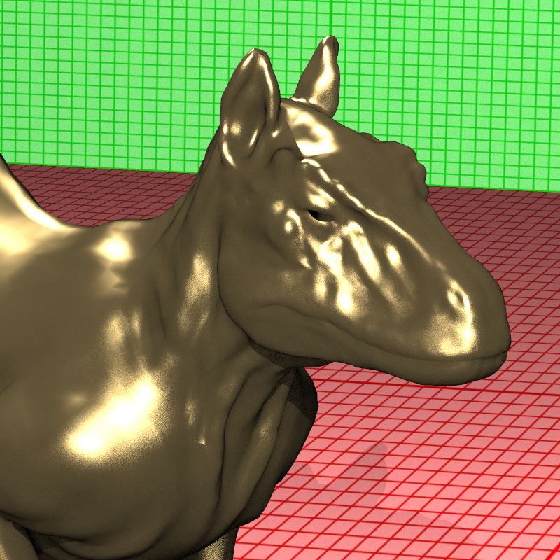

# BRDF with Phong, Blinn-Phong and Torrance-Sparrow Reflections

This section includes the experiences of implementing the BRDF with Phong, Blinn-Phong and Torrance-Sparrow Reflections.


# 1. BRDF

## Input
BRDFs are defined in a new section in the XML files as below. They are five different types of BRDF: Phong, Blinn-Phong, modified Phong, modified Blinn-Phong and Torrance-Sparrow. The modified BRDFs can be normalized or not with a field <normalized="true">. The exponent is given as <Exponent>. For the Torrance-Sparrow model the "Exponent'' parameter defines the exponent of the Blinn microfacet distribution. Finally, <kdfresnel="true"> field indicates the fraction of the diffuse light that is reflected must be computed from the Fresnel reflection. We will multiply the diffuse component by 1 - F (the Fresnel reflection) if this attribute is true.

Note that the BRDF is specified in the material with its identification number as a new field BRDF=<id>.

```xml  
<Scene>
    <BRDFs>
        <ModifiedBlinnPhong id="1" normalized="true">
            <Exponent>50</Exponent>
        </ModifiedBlinnPhong>
        <TorranceSparrow id="2" kdfresnel="false">
            <Exponent>50</Exponent>
        </TorranceSparrow>
        <ModifiedBlinnPhong id="3">
            <Exponent>50</Exponent>
        </ModifiedBlinnPhong>
        <OriginalBlinnPhong id="4">
            <Exponent>50</Exponent>
        </OriginalBlinnPhong>
        <ModifiedPhong id="5" normalized="true">
            <Exponent>50</Exponent>
        </ModifiedPhong>
        <ModifiedPhong id="6">
            <Exponent>50</Exponent>
        </ModifiedPhong>
        <OriginalPhong id="7">
            <Exponent>50</Exponent>
        </OriginalPhong>
    </BRDFs>
    <Materials>
        <Material id="1" BRDF="1">
            ...
        </Material>
    </Materials>
</Scene>
```

## Code Design
I added a new class for BRDFs as below.

```algorithm
Class BRDF
    float exponent
    bool  normalized = false
    bool  kdfresnel = false
    int   type

Class Material
    ...
    BRDF* brdf
```

## Algorithm
EXPLAIN BRDF shortly

Before starting coding, let's define our viewer vector (reverse ray direction), incident light vector and half vector as w_o, w_i and w_h, respectively.


## 1. Phong
Phong BRDF employs the w_r vector which is ```2(N*L)N - L``` where ```*``` indicates the dot product. N is the surface normal and L is the light vector.

```algorithm
Class Light
 function illuminance(ray, n, material):
 1. ... // previously
 2. brdf <- material.brdf
 3. if brdf.type is OriginalPhong:
 4.     f_wi_wo <- kd + ks * pow(dot(w_o, w_r), brdf.exponent) / dot(n, w_i)
 5.     L_r = f_wi_wo * dot(n, w_i) * L_i
 6. return L_r
```

## 2. Modified Phong
Dividing the cos_theta (dot(n, w_i)) may produce unstable results so that the modified version by removing cos_theta is suggested as below.

```algorithm
Class Light
 function illuminance(ray, n, material):
 1. ... // previously
 2. brdf <- material.brdf
 3. if brdf.type is ModifiedPhong:
 4.     f_wi_wo <- kd + ks * pow(dot(w_o, w_r), brdf.exponent)
 5.     L_r = f_wi_wo * dot(n, w_i) * L_i
 6. return L_r
```

In the modified version, we can also apply a normalization if it is enabled in the xml file. The normalization is given below.

EXPLAIN THE REASON BEHIND THAT

```algorithm
Class Light
 function illuminance(ray, n, material):
 1. ... // previously
 2. brdf <- material.brdf
 3. if brdf.type is ModifiedPhong:
 4.     f_wi_wo <- kd / PI + ks (brdf.exponent + 2) / 2PI * pow(dot(w_o, w_r), brdf.exponent)
 5.     L_r = f_wi_wo * dot(n, w_i) * L_i
 6. return L_r
```

## 3. Blinn-Phong
In Blinn-Phong reflection, we use the half vector, w_h, instead of w_r described above.

```algorithm
Class Light
 function illuminance(ray, n, material):
 1. ... // previously
 2. brdf <- material.brdf
 3. if brdf.type is OriginalBlinnPhong:
 4.     f_wi_wo <- kd + ks * pow(dot(n, w_h), brdf.exponent) / dot(n, w_i)
 5.     L_r = f_wi_wo * dot(n, w_i) * L_i
 6. return L_r
```

## 4. Modified Blinn-Phong
Again, we remove the cos_theta in the division part of f_wi_wo so that the model may produce more stable results.

```algorithm
Class Light
 function illuminance(ray, n, material):
 1. ... // previously
 2. brdf <- material.brdf
 3. if brdf.type is ModifiedBlinnPhong:
 4.     f_wi_wo <- kd + ks * pow(dot(n, w_h), brdf.exponent)
 5.     L_r = f_wi_wo * dot(n, w_i) * L_i
 6. return L_r
```

In the modified version, we can also apply a normalization if it is enabled in the xml file. The normalization is given below.

EXPLAIN THE REASON BEHIND THAT

```algorithm
Class Light
 function illuminance(ray, n, material):
 1. ... // previously
 2. brdf <- material.brdf
 3. if brdf.type is ModifiedPhong:
 4.     f_wi_wo <- kd / PI + ks (brdf.exponent + 2) / 2PI * pow(dot(n, w_h), brdf.exponent)
 5.     L_r = f_wi_wo * dot(n, w_i) * L_i
 6. return L_r
```

## 5. Torrance-Sparrow


## Implementation Process


## Final Results
Let's look at the final results of my implementation after all improving.

### brdf_phong (left:original, right: modified)
<p float="left">
  
  
</p>

### brdf_blinnphong (left:original, right: modified)
<p float="left">
  
  
</p>

### brdf_normalized (left:Phong, right: Blinn-Phong)
<p float="left">
  
  
</p>

### killeroo_blinnphong.xml
<p float="left">
  
  
</p>
```markdown
XML file is parsed in 0 sec
Maximum BVH depth is 15
Preprocessing is finished in 0 sec
Scene is created in 227 sec
```

### killeroo_torrancesparrow.xml
<p float="left">
  
  
</p>
```markdown
XML file is parsed in 1 sec
Maximum BVH depth is 15
Preprocessing is finished in 0 sec
Scene is created in 222 sec
```
