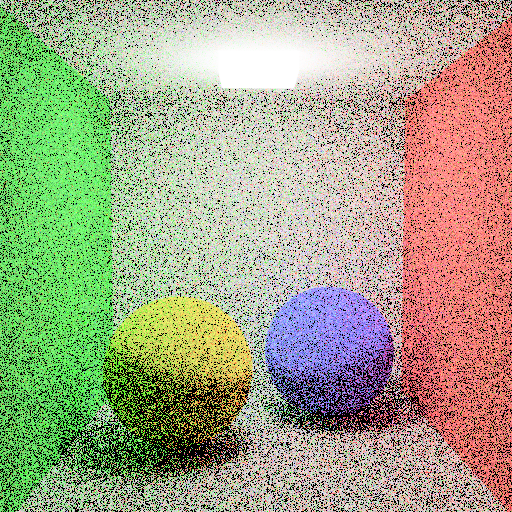
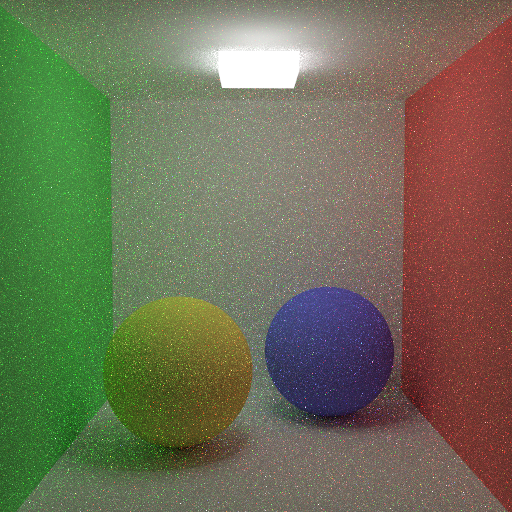

# Direct Lighting and Path Tracing

This section includes the experiences of implementing the Direct Lighting and Path Tracing.

# 1. Direct Lighting

## Input
With direct lighting, we can have object light sources in our scenes. Thus light sources can be defined under the <objects> attribute in the XML files. Light source can be mesh or sphere with specification <LightMesh> and <LightSphere>. They have <Radiance> element, which defines the light emitted by them. They are assumed to be
isotropic meaning that they emit equal radiance in all directions.

```xml  
<Scene>
    <Objects>
        <LightMesh id="1">
            <Material>1</Material>
            <Radiance>1.21 1.21 1.21</Radiance>
            <Faces vertexOffset="1">
                2 6 7
                7 3 2
            </Faces>
        </LightMesh>
        <LightSphere id="1">
            <Material>1</Material>
            <Center>11</Center>
            <Radius>0.2</Radius>
            <Radiance>31.831 31.831 31.831</Radiance>
        </LightSphere>
    </Objects>
</Scene>
```

## Code Design
I added new types of objects and radiance information indicating the emitted light from this object into the Object class. In addition, the sampling functions are implemented for light sources. The w_i indicates the sampled light direction from the hit point.

```algorithm
Class Object
    vec3  radiance
    int   type
    bool  isLight

    function getSampleLightDirection(pHit)
    function getPDF(w_i)
```

## Algorithm

In direct lighting, if the current object is a light, we will send its radiance directly without calling a shading method for material. But please note that reflected and refraction rays are still computed and promote the final color at this point.

```algorithm
Class Scene
 function raytracer (ray, &dist, count, rayTime):
 1. ... // previously
 2. Object object <- isIntersected(ray, dist, rayTime)
 3. vec3 pHit <- ray.o + ray.d * dist
 4. vec3 normal <- object.getNormal(pHit)
 5. if object.isLight:
 6.     color <- object.radiance
 7. else:
 8.     color <- shading(object, ray, pHit, normal, count, rayTime)
 9. color <- color + compute refraction and reflection color
10. return color
```

In the shading function, besides the previous light sources, the object light sources also contribute the color as below. Please note that we get the light direction by sampling on a particular light with getSampleLightDirection method. It uses the hit point to get a sample direction. In addition, we need a PDF function to contribute the color fairly.

```algorithm
Class Scene
 function shading(object, ray, pHit, normal, count, rayTime):
 1. ... // previously
 2. color <- directLightContribution(object, material, ray, pHit, normal)
 3. return color

Class Scene
 function directLightContribution(object, material, ray, pHit, normal):
2. color <- material.ambientRef * ambientLight
3. for light in lights:
4.     vec3 w_i <- light.getDirection(pHit, normal)
5.     vec3 o <- pHit + normal * shadowRayEpsilon
6.     if !isShadow(object, w_i, o, rayTime):
7.         vec3 radiance <- light.getRadiance()
8.         color <- color + material.illuminance(ray, w_i, normal, radiance)
9. for lightObject in lightObjects:
10.     vec3 w_i <- lightObject.getSampleLightDirection(pHit)
11.     vec3 o <- pHit + normal * shadowRayEpsilon
12.     if !isShadow(object, w_i, o, rayTime):
13.         float p_w <- lightObject.getPDF(d)
14.         color <- color + material.illuminance(ray, w_i, normal, lightObject.radiance)
15. return color

```

Let's look at the inside of the getSampleLightDirection method.

```algorithm
Class Object
 function getSampleLightDirection(pHit):
 1. if type is LightMesh:
 2.     Object face <- select a face of the mesh by considering surface area in the probability
 3.     float rand1 <- get a random number in [0-1]
 4.     float rand2 <- get a random number in [0-1]
 5.     vec3 p <- (1-rand2) * face.bVert->pos + rand2 * face.cVert->pos
 6.     vec3 q <- (1-sqrt(rand1)) * face.aVert->pos + sqrt(rand1) * p
 7.     return q - pHit
 8.
 9. if type is LightSphere:
10.     float cos_theta_max <- compute cosine of theta max
11.     float rand1 <- get a random number in [0-1]
12.     float rand2 <- get a random number in [0-1]
13.     float phi <- 2 * PI - rand1
14.     float theta <- acos(1 - rand2 + rand2 * cos_theta_max)
15.     
16.     mat3 uvw <- compute the orthonormal matrix
17.     vec3 w_i <- cos(theta) * w + sin(theta) * cos(phi) * v + sin(theta) * sin(phi) * u
18.     float dist <- find the distance from the pHit to an intersection point at the object
19.     w_i <- localMatrix * vec4(w_i, 0.f)
20.     return w_i * dist
```

At this point, please note that we send light direction by multiplying it with the distance instead of sending an unit vector. It will be useful for the computation of shadow later.

Finally, we compute the pdf value as below. Area information is computed in the pre-processing step.

```algorithm
Class Object
 function getPDF(w_i):
 1. if type is LightMesh:
 2.     float declination <- dot(normal, normalize(-w_i))
 3.     p_w <- declination * area / dot(w_i, w_i)
 4.
 5. if type is LightSphere:
 6.     float cos_theta_max <- sqrt(1.f - 1.f / dot(w_i, w_i))
 7.     p_w <- 2 * PI * (1.f - cos_theta_max)
 8. return p_w
```

## Implementation Process
<p float="left">
  
  
</p>

In my first implementation, I used the sampled light direction directly. However, they produced smaller shadows because they are unit vectors instead of a vector from the hit point to the light source. This result can be seen in the left. In order to fix that problem, we can find the distance between the intersection point and light source and multiply the unit light vector with this sample to be used in the shadow calculation. The fixed result can be seen on the right.

## Results

#### cornellbox_jaroslav_diffuse (left: no object light source, right: object light source)
<p float="left">
  
  
</p>

#### cornellbox_jaroslav_glossy (left: no object light source, right: object light source)
<p float="left">
  
  
</p>

#### cornellbox_jaroslav_glossy_sphere (left: ellipsoid light, right: sphere light)
<p float="left">
  
  
</p>

#### cornellbox_jaroslav_glossy_small
<p float="left">
  
</p>


# 2. Path Tracing

## Input
The XML file supports new fields, <Renderer> and <RendererParams> in the Camera for Path Tracing. Renderer can be DirectLighting or PathTracing. Lack of this element means DirectLighting. RendererParams may include: ImportanceSampling, NextEventEstimation, and RussianRoulette as below.

```xml  
<Scene>
    <Cameras>
        <Camera id="8" type="lookAt" handedness="right">
            <Renderer>PathTracing</Renderer>
            <RendererParams>ImportanceSampling RussianRoulette</RendererParams>
        </Camera>
    </Cameras>
</Scene>
```

## Code Design
I added pathTracing enabled information and renderer parameters to the Camera class and implemented the sampling methods from a hit point at the objects.

```algorithm
Class Camera
    bool  pathTracing <- false
    bool  russianRoulette <- false
    bool  importanceSampling <- false
    bool  nextEventEstimation <- false

Class Object
    function getSampleDirection(normal, importanceSamplingEnabled)
```

## Algorithm
In path tracing, we do not contribute color with light sources directly unless the NextEventEstimation is enabled. Instead, we sample a random light ray, w_i and hope the ray intersects with a light source eventually.

### Pure Path Tracing
In the rayTracer method, we eliminate the direct contribution of light source in the line 5 as below. Moreover, we eliminate the direct contribution in the shading method in the line 3, as well.

```algorithm
Class Scene
 function raytracer (ray, &dist, count, rayTime):
 1. ... // previously
 2. Object object <- isIntersected(ray, dist, rayTime)
 3. vec3 pHit <- ray.o + ray.d * dist
 4. vec3 normal <- object.getNormal(pHit)
 5. if not cameras[activeCamera].pathTracing and object.isLight:
 6.     color <- object.radiance
 7. else:
 8.     color <- shading(object, ray, pHit, normal, count, rayTime)
 9. color <- color + compute refraction and reflection color
10. return color

Class Scene
 function shading(object, ray, pHit, normal, count, rayTime):
 1. ... // previously
 2. color <- vec3(0)
 3. if not cameras[activeCamera].pathTracing:
 4.     color <- color + directLightContribution(object, material, ray, pHit, normal)
 5. if cameras[activeCamera].pathTracing:
 6.     vec3 w_i <- object.getSampleDirection(normal)
 7.     vec3 o <- pHit + normal * shadowRayEpsilon
 8.     vec3 radiance <- raytracer(w_i, o, dist, count-1, rayTime)
 9.     color <- color + object.radiance
10.     float p_w <- 2 * PI
11.     color <- color + material.illuminance(ray, w_i, normal, radiance) * p_w
12. return color

Class Object
 function getSampleDirection(normal):
 1. float rand1 <- dis(gen)
 2. float rand2 <- dis(gen)
 3. float phi <- 2 * PI * rand1
 4. float theta <- acos(rand2)
 5. mat3 uvw <- compute the orthonormal matrix
 6. vec3 w_i <- sin(theta) * cos(phi) * u + sin(theta) * sin(phi) * v + cos(theta) * w
 7. return w_i
```
The result of diffuse pure Path Tracing:
<p float="left">
  
</p>

### Next Event Estimation
When Next Event Estimation is enabled, we contribute the light sources directly and generate random samples as a light direction unless it intersects with a light source. In order to achieve it, I added a ignoreLights flag to the rayTracer method. If the ignoreLights is true and the intersected object is a light, it will be ignored and zero color is sent.

```algorithm
Class Scene
 function raytracer (ray, &dist, count, rayTime, ignoreLights):
 1. ... // previously
 2. Object object <- isIntersected(ray, dist, rayTime)
 3. if ignoreLights and object.isLight:
 4.     return vec3(0)
 5. ... // previously
 6. return color

Class Scene
 function shading(object, ray, pHit, normal, count, rayTime):
 1. ... // previously
 2. color <- vec3(0)
 3. if not cameras[activeCamera].pathTracing or cameras[activeCamera].nextEventEstimation:
 4.     color <- color + directLightContribution(object, material, ray, pHit, normal)
 5. if cameras[activeCamera].pathTracing:
 6.     vec3 w_i <- object.getSampleDirection(normal)
 7.     vec3 o <- pHit + normal * shadowRayEpsilon
 8.     bool ignoreLights <- cameras[activeCamera].nextEventEstimation ? true : false
 9.     vec3 radiance <- raytracer(w_i, o, dist, count-1, rayTime, ignoreLights)
10.     color <- color + object.radiance
11.     float p_w <- 2 * PI
12.     color <- color + material.illuminance(ray, w_i, normal, radiance) * p_w
13. return color
```

The left is pure Path Tracing while the right is improved with Next Event Estimation.

<p float="left">
  
  
</p>

### Importance Sampling
It is another sampling method as below. I added a new feature to the getSampleDirection method of the Object class. If the importanceSampling is enabled, it takes a sample according to this method as in the line 6. The importanceSampling also affects the PDF value as in the line 12.

```algorithm
Class Scene
 function shading(object, ray, pHit, normal, count, rayTime):
 1. ... // previously
 2. color <- vec3(0)
 3. if not cameras[activeCamera].pathTracing or cameras[activeCamera].nextEventEstimation:
 4.     color <- color + directLightContribution(object, material, ray, pHit, normal)
 5. if cameras[activeCamera].pathTracing:
 6.     vec3 w_i <- object.getSampleDirection(normal, cameras[activeCamera].importanceSampling)
 7.     vec3 o <- pHit + normal * shadowRayEpsilon
 8.     bool ignoreLights <- cameras[activeCamera].nextEventEstimation ? true : false
 9.     vec3 radiance <- raytracer(w_i, o, dist, count-1, rayTime, ignoreLights)
10.     color <- color + object.radiance
11.     float cosTheta <- dot(normalize(w_i), normal)
12.     float p_w <- cameras[activeCamera].importanceSampling ? PI/cosTheta: 2*PI
13.     color <- color + material.illuminance(ray, w_i, normal, radiance) * p_w
14. return color

Class Object
 function getSampleDirection(normal, importanceSampling):
 1. float rand1 <- dis(gen)
 2. float rand2 <- dis(gen)
 3. float phi <- 2 * PI * rand1
 4. float theta <- importanceSampling ? asin(sqrt(rand2)) : acos(rand2)
 5. mat3 uvw <- compute the orthonormal matrix
 6. vec3 w_i <- sin(theta) * cos(phi) * u + sin(theta) * sin(phi) * v + cos(theta) * w
 7. return w_i
```

The left is pure Path Tracing while the right is improved with Importance Sampling.

<p float="left">
  
  
</p>

### Russian Roulette

Russian Roulette is a stopping method in Path Tracing. In my implementation, I have used cosine angle between the normal (n) and sampled ray direction (w_i) as a stopping condition, q. I added a new argument, boolean terminated flag, to the shading function. If it is true, the rayTracer will be terminated without computing refraction and reflection rays.

```algorithm
Class Scene
 function raytracer (ray, &dist, count, rayTime, ignoreLights):
 1. if count < 0 and not cameras[activeCamera].russianRoulette:
 2.     return vec3(0)
 3. ... // previously
 4. bool terminated <- false
 5. if object.isLight:
 6.     color <- object.radiance
 7. else:
 8.     color <- shading(object, ray, pHit, normal, count, rayTime, terminated)
 9. if terminated:
10.     return vec3(0)
11. ... // previously
12. return color

Class Scene
 function shading(object, ray, pHit, normal, count, rayTime, &terminated):
 1. ... // previously
 2. color <- vec3(0)
 3. if not cameras[activeCamera].pathTracing or cameras[activeCamera].nextEventEstimation:
 4.     color <- color + directLightContribution(object, material, ray, pHit, normal)
 5. if cameras[activeCamera].pathTracing:
 6.     vec3 w_i <- object.getSampleDirection(normal, cameras[activeCamera].importanceSampling)
 7.     float cosTheta <- dot(normalize(w_i), normal)
 8.     if cameras[activeCamera].russianRoulette and count < 0:
 9.         q <- 1 - cosTheta
10.         if random number <= q:
11.             terminated <- true
12.             return color + object.radiance
13.
14.     vec3 o <- pHit + normal * shadowRayEpsilon
15.     bool ignoreLights <- cameras[activeCamera].nextEventEstimation ? true : false
16.     vec3 radiance <- raytracer(w_i, o, dist, count-1, rayTime, ignoreLights)
17.     color <- color + object.radiance
18.     float cosTheta <- dot(normalize(w_i), normal)
19.     float p_w <- cameras[activeCamera].importanceSampling ? PI/cosTheta: 2*PI
20.     color <- color + material.illuminance(ray, w_i, normal, radiance) * p_w
21.
22.     if cameras[activeCamera].russianRoulette:
23.         color <- color / (1 - q)
24. return color
```

## Results
Let's look at the final results of my implementation after all improving.

#### Diffuse object (left: original, right: with importance sampling)
<p float="left">
  
  
</p>

#### Diffuse object with Russian Roulette stopping (left: original, right: with importance sampling)
<p float="left">
  
  
</p>

#### Diffuse object with Next Event Estimation (left: original, right: with importance sampling)
<p float="left">
  
  
</p>

#### Diffuse object with Next Event Estimation and Russian Roulette stopping (left: original, right: with importance sampling)
<p float="left">
  
  
</p>

#### Glass object (left: original, right: with importance sampling)
<p float="left">
  
  
</p>

#### Glass object with Russian Roulette stopping (left: original, right: with importance sampling)
<p float="left">
  
  
</p>

#### Glass object with Next Event Estimation (left: original, right: with importance sampling)
<p float="left">
  
  
</p>

#### Glass object with Next Event Estimation and Russian Roulette stopping (left: original, right: with importance sampling)
<p float="left">
  
  
</p>

#### VeachAjar Scene
<p float="left">
  
</p>
```markdown
XML file is parsed in 0 sec
Maximum BVH depth is 15
Preprocessing is finished in 0 sec
Scene is created in around 15 hours with 640 samples
```
